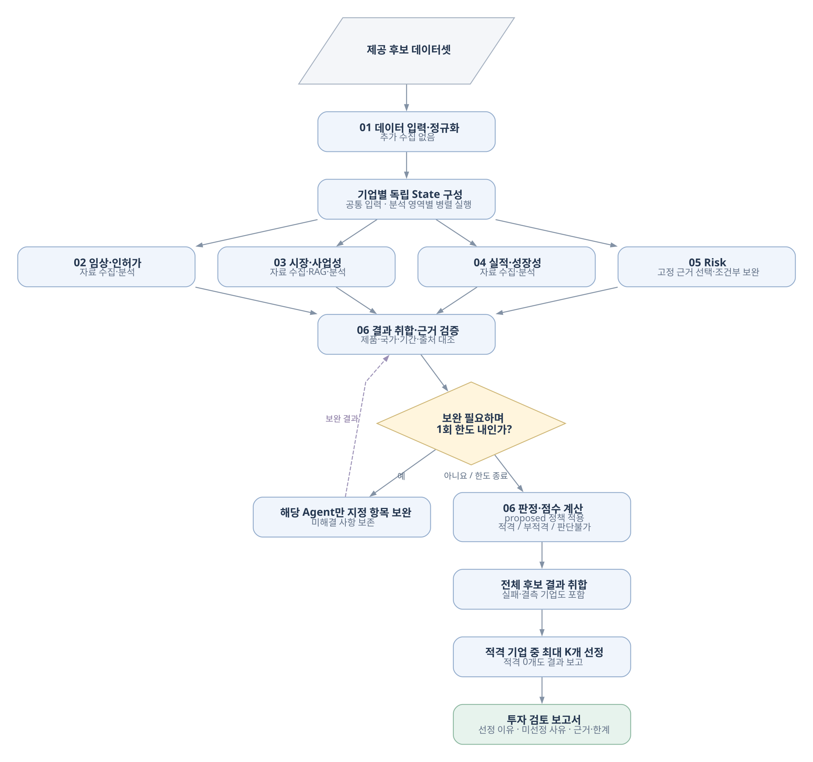

# MedAI-Agent

의료 AI 스타트업 투자 검토 · LangGraph 기반 멀티 에이전트

## 개요

| 항목 | 내용 |
|---|---|
| 대상 | [고정 후보 42개 기업](data/startup_list.csv), Series B~C 우선 검토 |
| 입력 | 기업·대표 제품·목표국·기준일, 공개 자료 |
| 분석 | 임상·인허가, 시장·사업성, 실적·성장성, Risk |
| 산출물 | 평가표, 근거, 선정 사유, 후속 실사 질문 |
| 선정 | 적격 기업 최대 5개 |
| 구현 상태 | 모듈별 개발·통합 진행 중, 전체 실행 진입점 미구현 |

## 구조

<p align="center">
  <a href="docs/readme/images/overview.svg"></a>
</p>

↓ 노드 이름 클릭 시 상세 구현 흐름도 확인 가능.

| 노드 | 처리 | 평가 연결 |
|---|---|---|
| [입력·정규화](docs/readme/images/input.svg) | CSV 로딩, 식별자·공통 입력 정규화 | — |
| [임상·인허가](docs/readme/images/clinical.svg) | 규제 기록·연구·회사 주장 대조 | C1 |
| [시장·사업성](docs/readme/images/market.svg) | 시장 성장·수요·도입·수익화 분석 | C2·C3·C4 |
| [실적·성장성](docs/readme/images/traction.svg) | 매출·계약 검증, 상업화·성장 평가 | C5 |
| [Risk](docs/readme/images/risk.svg) | 외부 자원 의존·핵심 역할 연속성·운영 사건 분석 | C6 변환용 근거 |
| [투자 심사](docs/readme/images/review.svg) | 근거 검증, 보완 요청, 채점·선정·보고서 | 최종 판정 |

- 실행 구조: 4개 분석 노드 병렬 처리 후 심사
- 공통 근거 계약(설계): `Source → Evidence → Finding`
- 시장 RAG(설계): `BAAI/bge-m3` Dense → FAISS → 범위 필터·검색
- Risk(구현): 고정 자료 기반 LangGraph, 규칙 기반 근거 선택·분기, 외부 재검색 없음
- Risk 보완 한도: 내부 1회, 실행당 모델 요청 최대 2회

## 평가 정책

`proposed-2.0` · 설계 초안

| 항목 | 기준 | 가중치 |
|---|---|---:|
| C1 | 임상 근거 | 20% |
| C2 | 시장 성장 | 10% |
| C3 | (수요 + 도입) / 2 | 15% |
| C4 | 수익화 | 15% |
| C5 | 0.7 × 상업화 S + 0.3 × 성장 T | 25% |
| C6 | Risk 근거 → OP1~OP5 체크 → 점수 | 15% |

```text
총점 = Σ(가중치 × 항목 점수 / 5) / Σ(적용 가중치) × 100
```

- 적격: 총점 ≥ 60, 모든 적용 항목 ≥ 2
- 부적격: 확인된 중대 차단 G01·G02 또는 점수 기준 미달
- 판단불가: 중대 차단 의심·필수 결측·충돌·검증 오류·적용 점수 미확인, 총점 `null`
- C5 예외: T만 미확인 시 S 적용, 한계 기록
- C6: 심사 어댑터 변환 필요, Risk 자체 종합 점수 없음
- 미확인: `null` 보존, 제외 후 재가중 금지
- 정렬: 총점 → C5 → C1 내림차순 → `company_id` 오름차순
- 심사 보완: 기업당 최대 1라운드

## 재현 방법

Python 3.11+ 권장 · 저장소 루트 기준 · 개별 모듈 실행

```bash
# 설치
python3 -m venv .venv
source .venv/bin/activate
pip install -r requirements.txt
cp -n .env.example .env

# Risk 실행: .env 설정 및 입력 데이터 준비 후
python -m agents.risk --company-id "등록된_company_id" --output outputs/risk_result.json

# 테스트
python -m pytest tests agents/risk -q
```

- 필수 설정: `.env`의 `OPENAI_API_KEY`, `RISK_MODEL`
- 필수 데이터: `agents/risk/data/frozen_manifest.json` 및 등록 원문 별도 확보 (Git 제외)
- [상세 설정·실적 분석 실행](docs/readme/development.md)

## 문서

- [설치·실행·테스트·폴더 구조](docs/readme/development.md)
- [Risk Agent 입력·출력](docs/readme/risk.md)
- [상세 평가 정책](docs/readme/evaluation_policy.md)
- [실적·성장성 판단 기준](docs/readme/traction_growth.md)
- [전체 흐름도](docs/readme/images/overview.svg)

## Future Work

| 영역 | Future Work |
|---|---|
| 임상·인허가 | 임상·규제 데이터 연동, 근거 정량 추출·충돌 검증 |
| 시장·사업성 | 원문 품질·검색 고도화, 검색 성능 비교 평가 |
| 실적·성장성 | 법인·재무·고용 데이터 정합성 강화, 판정 정확도 평가 |
| Risk | 후속 근거 확충, 판단 기준·보완 루프 개선, 정확도 평가 |
| 투자 심사·보고서 | 미정 |

[상세 개선 계획](docs/readme/future_work.md)

## Contributors

SKALA 4기 울산캠퍼스 2반 5조

<table width="730" border="1" cellspacing="0" cellpadding="6">
  <tr>
    <td width="20%" align="center"><a href="https://github.com/minsol1"><br><b>김민솔</b></a></td>
    <td width="20%" align="center"><a href="https://github.com/insidesight0921-stack"><br><b>변현준</b></a></td>
    <td width="20%" align="center"><a href="https://github.com/apej460"><br><b>서준영</b></a></td>
    <td width="20%" align="center"><a href="https://github.com/overdozya"><br><b>안동선</b></a></td>
    <td width="20%" align="center"><a href="https://github.com/yuhalyn"><br><b>유하린</b></a></td>
  </tr>
  <tr>
    <td width="20%" align="center">투자 심사·보고서 생성<br>Agent 구축</td>
    <td width="20%" align="center">실적·성장성 분석<br>Agent 구축</td>
    <td width="20%" align="center">임상·인허가 분석<br>Agent 구축</td>
    <td width="20%" align="center">시장·사업성 분석<br>Agent·RAG 구축</td>
    <td width="20%" align="center">Risk 분석<br>Agent 구축</td>
  </tr>
</table>

## 최종 산출물 예시

[최종 산출물 예시 보기](docs/readme/output_example.md)
