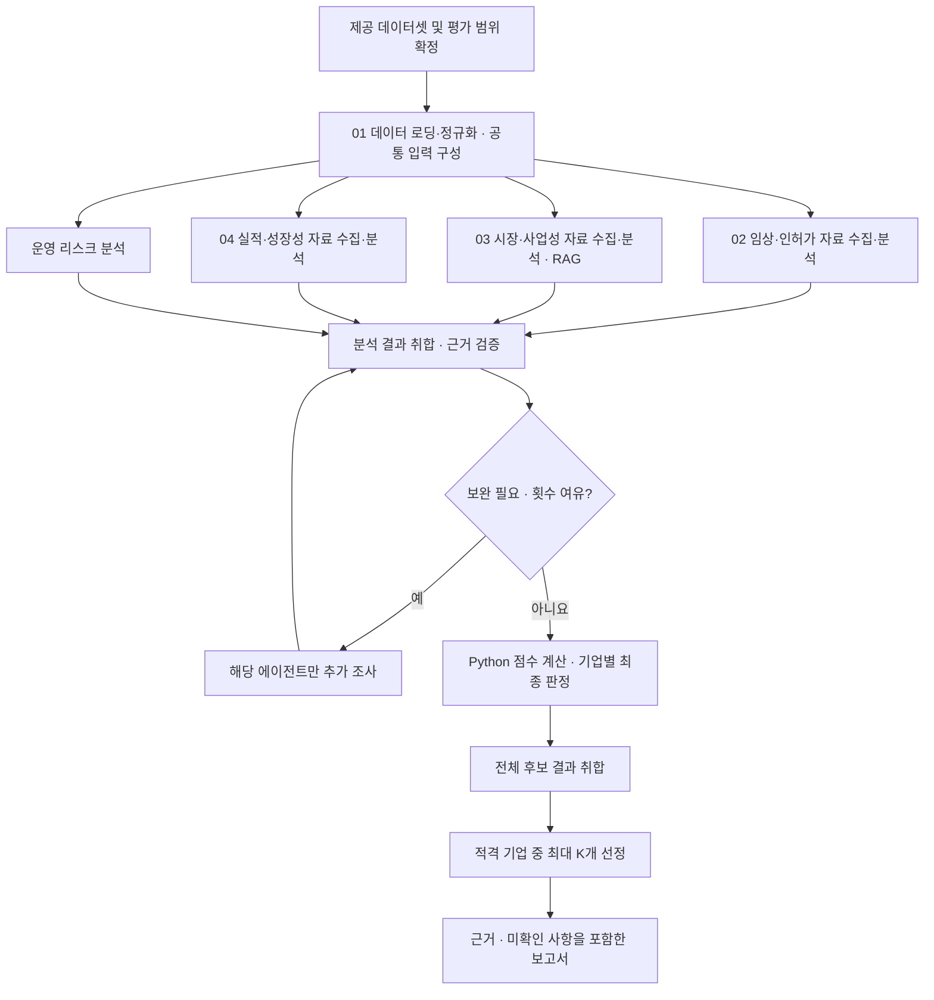

# MedAI-Agent

Healthcare AI 스타트업의 공개 자료를 모아 **임상·인허가, 시장·사업성, 실적·성장성, 운영 리스크**를 분석하고, 근거를 추적할 수 있는 투자 검토 보고서를 만드는 멀티 에이전트 프로젝트입니다.

가상 VC의 심사역을 주요 사용자로 설정합니다. 기업마다 흩어진 자료를 같은 기준으로 정리해 초기 검토 시간을 줄이고, 추가 실사에서 확인해야 할 질문을 제시하는 것이 목표입니다.

> **현재 팀 구현:** Risk 에이전트의 단독 실행, 입력 예제, 테스트.
> **현재 이 브랜치 추가:** 시장·사업성 Agent, BAAI/bge-m3 기반 dense RAG, 로컬 Chroma index builder, 입력 예제와 테스트.
> **통합 예정:** 상위 LangGraph, 전문 Agent와 투자심사 Agent의 최종 공통 계약, 최종 보고서 생성.
> 공통 State와 평가 정책은 팀 검토 단계이며, 시장 Agent는 다른 Agent의 인터페이스를 변경하지 않고 독립 노드로 연결됩니다.

## 분석 범위

- **전체 도메인:** Healthcare AI. 의료영상, 진료지원, 디지털 치료, 건강관리, 신약개발, 의료 운영 AI 등을 포함합니다. 의료영상 외 기업이라는 이유로 `out_of_scope` 처리하지 않습니다. Healthcare AI 밖임이 확인된 경우에만 범위 제외하며, 불명확하면 `unknown`으로 기록합니다.
- **후보 기준:** 비상장, Series B~C, Exit 미완료, AI가 핵심 제품인 기업.
- **고정 입력 데이터셋:** [data/startup_list.csv](data/startup_list.csv). 1번 단계는 이 데이터셋을 읽으며 후보 기업이나 외부 자료를 추가 수집하지 않습니다. 목록에 포함되었다고 후보 조건이 검증된 것은 아닙니다.
- **분석 단위:** 기업·제품·국가·사용 목적·기준일을 고정해 자료를 비교합니다.
- **시장 분석 기본 단위:** 대표 제품 1개를 분석 전에 선정하고 이유를 기록합니다. `scope_weight`는 기본 입력에서 요구하지 않으며, 다제품 집계는 별도 합의 후 확장합니다. 대표 제품의 결과를 기업 전체 제품에 일반화하지 않습니다.
- **결과:** 기업별 적격·부적격·판단불가, 적격 기업 중 최대 K개 선정, 근거 및 실사 질문을 포함한 보고서.

## 전체 흐름

아래는 구현 목표입니다. **RAG는 시장·사업성 분석에만 적용**합니다.



1번 단계에서 제공 데이터셋을 로딩·정규화하고 기업·제품 식별자, 기준일, 평가 범위 등 공통 입력을 구성한 뒤 네 분석을 병렬로 수행합니다. 1번은 웹검색·크롤링·후보 확장을 수행하지 않습니다. 2·3·4번은 각자의 분석에 필요한 외부 자료를 직접 수집합니다. 5번 Risk의 기존 자체 검색은 유지합니다. 투자 심사에서 근거 부족·충돌·오래된 정보·해석 오류가 발견되면 해당 분석에만 구체적인 보완 질문을 전달합니다.

보완은 기업당 최대 1라운드를 기본안으로 합니다. 기존 판단, 관련 근거, 질문, 완료 조건, 검색 예산을 함께 전달하고 요청하지 않은 결과는 유지합니다. 한도에 도달하면 미확인 사항을 기록하고 종료합니다. 적격 기업이 없어도 전체 검토 결과와 사유를 보고합니다.

## 에이전트 구성

| 번호 | 에이전트 | 담당 범위 | RAG |
|---|---|---|---|
| 01 | 데이터 입력·정규화 | 제공 데이터셋 로딩, 형식·중복 확인, 기업·제품 식별자 및 공통 입력 구성. 추가 수집 없음 | X |
| 02 | 임상·인허가 | 공식 규제 기록·연구·회사 주장을 직접 수집하고 제품·국가·용도별 대조 | X |
| 03 | 시장·사업성 | 시장·고객·구매 자료 직접 수집 및 RAG 검색. 성장·수요·도입·상용화·수익화 분석 | O |
| 04 | 실적·성장성 | 공시·계약·실증·고객·고용 자료를 직접 수집하고 상업화·성장 분석 | X |
| 05 | 운영 리스크 | 외부 자원 의존, 핵심 역할 연속성, 운영 사건과 대응 | X |
| 06 | 투자 심사·보고서 | 결과 검증, 보완 요청, 점수 계산, 판정·선정·보고서 작성 | X |

역할 간 중복을 줄이기 위해 시장은 고객군의 도입·상용화 가능성을, 실적은 해당 기업의 실제 도입 성과를 다룹니다. 시장의 체크 기준은 Healthcare AI 세부 사업유형별로 선택하고 `checklist_id`와 버전을 기록합니다. 예를 들어 진료지원은 업무·시스템 연동, 소비자 건강관리는 이용·유지·결제, 신약개발은 연구 검증·데이터·파트너 도입을 확인합니다. 동일 사업유형에는 같은 기준을 적용합니다. Risk는 임상·시장·실적을 다시 평가하지 않고 사업 지속성에 관한 사실·잠재 영향·대응·실사 질문을 제공합니다. 투자 심사와 보고서 작성은 구현 시 내부 노드로 나눌 수 있습니다.

## 근거 관리와 평가 원칙

- 회사 주장, 확인된 사실, 분석자의 해석, 미확인 정보를 구분합니다.
- 출처의 URL·발행기관·발행일·확인일과 원문 위치를 보존합니다.
- 검색 미발견, 조회 실패, 확인된 부정 사실을 구분합니다. **정보가 없다는 이유로 안전하거나 위험하다고 단정하지 않습니다.**
- 기준일 이후 자료와 중복 보도자료를 점수 근거로 잘못 사용하지 않도록 검증합니다.
- LLM은 자료 추출과 해석을 담당하고, 점수·성장률·가중 총점은 Python으로 계산합니다.

현재 평가 정책은 **팀 검토용 초안 `proposed-2.0`**입니다. C2/C3/C4의 매핑·채점 기준과 아래 가중치는 제안값이며, 팀 최종 확정 전 고정 정책으로 배포하지 않습니다. 확정 시 평가 버전을 올리고 모든 비교 대상에 동일하게 적용합니다.

| 평가 항목 | 가중치 |
|---|---:|
| 임상 근거 | 20% |
| 시장 성장 | 10% |
| 고객·시장 수요 및 도입·상용화 가능성 | 15% |
| 수익화 | 15% |
| 실적·성장 | 25% |
| 운영 대비 | 15% |

초안은 항목별 0~5점, 미확인 `null`을 사용합니다. 확인된 중대 차단은 부적격, 핵심 정보 부족은 판단불가로 처리합니다. 적용 항목 모두 2점 이상·가중 총점 60점 이상이면 적격으로 분류하고, 적격 기업만 순위를 매깁니다. 세부 조건과 예외는 아래 [상세 평가 기준](#상세-평가-기준)에 정리합니다.

시장 분석은 `market_growth`, `demand`, `adoption`, `monetization`을 반환하도록 설계합니다. `market_growth`는 CAGR 기반 성장 점수이며 절대 시장규모는 `market_metrics`에 별도로 기록합니다. 기존 `size`는 이전 결과를 읽을 때만 별칭으로 허용하고 두 필드를 함께 합산하지 않습니다. 제안 매핑은 C2=`market_growth`, C3=(`demand`+`adoption`)/2, C4=`monetization`입니다. 시장 종합점수는 표시용이며 최종 총점에 다시 더하지 않습니다. 미확인 체크는 `no`나 0점으로 바꾸지 않습니다.

### 공통 State 설계

기업별 State는 공통 프로필, 네 분석 결과, 출처, 보완 요청·응답, 최종 심사를 공유합니다. 상위 State는 후보 목록과 기업별 결과를 모읍니다.

```text
기업별: company_id, company_profile, products, as_of
        clinical_analysis, market_analysis, traction_analysis, risk_analysis
        sources, review_requests, review_responses, review_round
        investment_review, errors
상위:   candidates, results_by_company_id, selection_config, final_report
```

통합 결과에는 실행·스키마·평가 버전을 포함하고, 출처 → 사실 → 판단을 ID로 연결할 예정입니다. 현재 Risk 모듈의 실제 입출력은 [Risk 문서](agents/risk/README.md)를 따릅니다.

시장 분석의 제품 입력 설계는 다음과 같습니다. 필수 키의 값이 미확인이면 `null`과 `missing_item`을 기록합니다.

| 입력 필드 | 요구 사항 |
|---|---|
| `product_id`, `product_type`, `intended_use` | 제품 식별자·사업유형·사용 목적을 담는 필수 키 |
| `target_customer`, `buyer` | 목표 고객과 실제 구매·지불 주체를 구분하는 필수 키 |
| `modality`, `hospital_type`, `indication` | 선택 입력. 비영상·비병원 제품에서 누락되어도 그 자체로 오류나 범위 제외가 아님 |

근거는 **Source → Evidence → Finding**으로 연결하고, `unknown` 처리와 기업당 1회 보완을 유지합니다. 위 입력·출력 변경은 시장 분석 설계이며 현재 Risk 코드의 입력 계약을 바꾸지는 않습니다.

## 데이터와 시장 RAG

기업·투자사 발표, 공식 규제 기록, 논문, 시장 보고서, 고객·산업·조달 자료, 공시와 운영 공지를 활용합니다. 제공 데이터셋에서 구성한 공통 프로필을 검색의 출발점으로 사용하며, 2·3·4번이 각자 확보한 자료를 Source → Evidence → Finding으로 연결합니다. 최초 병렬 실행은 다른 분석의 완성 결과를 필수 입력으로 요구하지 않으며, 취합 후 동일 제품·국가·기간인지 대조합니다. 입력 누락은 미확인으로 기록하고, 담당별 추가 조사 또는 보완 요청으로 처리합니다. 1번으로 되돌려 별도 수집을 시키지 않습니다.

시장 RAG는 `문서 로딩 → 페이지별 텍스트 추출 → 청크 분할 → BAAI/bge-m3 임베딩 → Chroma 영속 인덱스 → dense 검색 → 원문 근거 연결` 순서로 구현되어 있습니다. 입력 문서는 총 200쪽 이내로 검사하며, 페이지 번호와 문서 메타데이터를 모든 청크에 보존합니다. Hybrid 검색은 확장 지점만 두고 현재 제출 범위는 dense baseline입니다.

### 청킹 방식

```
PDF
→ pypdf로 페이지별 텍스트 추출
→ 페이지 안에서 공백 기준 토큰 분리
→ 700토큰씩 자름
→ 다음 청크에 앞 청크의 마지막 100토큰을 중복 포함
```

- `chunk_size`: 700
- `overlap`: 100
- 실제 이동 간격: 600
- 환경변수로 변경 가능
    - `MARKET_RAG_CHUNK_SIZE`
    - `MARKET_RAG_CHUNK_OVERLAP`

### 실제 데이터 결과

원본 PDF는:

- PDF 6개
- 물리적 202쪽
- 빈 페이지 2쪽을 `metadata.csv`로 제외
- 실제 인덱싱 대상 200쪽

파싱 결과:

- 텍스트가 있는 페이지: 193쪽
- 빈 페이지 또는 이미지 위주 페이지: 7쪽
- 최종 청크: 193개

### 청크에 보존한 메타데이터

```
chunk_id
document_id
title
publisher
published_at
region
segment
source_type
source_url
path
page
chunk_index
token_start
token_count
```

검색결과에서 다음과 같이 추적 가능.

```
Evidence
→ chunk_id
→ document_id
→ 원본 PDF
→ 실제 page
→ 공식 source_url
```

`chunk_id`는 아래 정보를 SHA-256으로 해싱

```
document_id + page + chunk_index + chunk text
```

### 임베딩·Vector DB 방식

```
청크 텍스트
→ BAAI/bge-m3
→ 벡터 정규화
→ ChromaDB persistent collection
```

- 임베딩 모델: `BAAI/bge-m3`
- 임베딩 정규화: 활성화
- Vector DB: 로컬 ChromaDB
- 거리 함수: cosine
- 저장 경로: `data/vectorstore/market/`
- 바깥 처리 묶음: 64청크
- 모델 내부 embedding batch: 16개

### 검색 방식

- **Dense Search baseline**
- Chroma Top-K: 5
- 동일 `chunk_id` 중복 제거
- 점수가 높은 순으로 정렬
- 영역별 최대 10개 청크만 분석기에 전달

### 병렬 실행 문제 처리

4개 분석 노드를 병렬 실행해서 각 스레드가 bge-m3를 동시에 로드하려고 해서 메모리가 터졌음. 그래서 임베딩 객체를 하나만 공유하고:

- 모델 최초 로드에 lock
- `encode_document`
- `encode_query`

호출에도 lock, 모델은 프로세스당 한 번만 로드하고, 네 영역이 같은 인스턴스를 안전하게 공유

## 설치 및 실행

Python 3.10 이상을 사용하며 저장소 루트에서 실행합니다. Apple Silicon 개발환경에서는 Python 3.11을 권장합니다.

```bash
python -m venv .venv
source .venv/bin/activate
python -m pip install -r requirements.txt
```

### Market RAG 데이터셋 설치

`market_rag_dataset.zip`을 압축 해제한 후 프로젝트 루트의 `data/market_rag/` 디렉토리에 넣어주세요.

```text
MedAI-Agent/data/market_rag/
├── reports/*.pdf
├── papers/*.pdf
└── metadata.csv
```

PDF와 생성된 Vector DB는 Git에 커밋하지 않습니다. 페이지 수 확인과 Index 생성 명령은 다음과 같습니다.

```bash
python -m rag.market.dataset_stats
python -m rag.market.build_index --rebuild
```

Vector DB는 `data/vectorstore/market/`에 생성됩니다.

### API 없이 Market 데모 실행

```bash
python -m agents.market \
  --input examples/market/input.json \
  --output outputs/market_demo.json \
  --demo
```

데모는 검색·LLM 호출 없이 입출력 연결만 확인합니다. 실제 기업 분석 결과를 생성하지 않습니다.

### API를 사용한 Market 분석

로컬 `.env`에 다음 환경변수를 설정합니다. `.env.example`은 변수 형식을 공유하는 템플릿입니다.

| 변수 | 용도 |
|---|---|
| `OPENAI_API_KEY` | 모델 API 인증 |
| `MARKET_MODEL` | structured output을 지원하는 OpenAI 모델 ID |
| `TAVILY_API_KEY` | 웹검색 API 인증 |

```bash
python -m agents.market \
  --input examples/market/input.json \
  --output outputs/market_result.json
```

실제 기업을 분석할 때는 예제를 해당 기업의 State JSON으로 교체합니다. 현재 Web Search 호출 한도는 기본 6회, 보완 한도는 1회입니다. 최종 투자 가중치와 전체 투자 판단은 Market Agent의 책임이 아닙니다.

CLI 결과 JSON은 `market_analysis`와 선택적인 `review_response`를 최상위 키로 가집니다. 상위 LangGraph에 연결하는 `market_agent_node`는 공통 State의 `market_analysis`만 갱신합니다.

입력 예시는 [examples/market](examples/market), 상세 실행 방식과 반환 구조는 [시장 Agent 문서](docs/market_agent.md)를 참고하세요.

### 기존 Risk 단독 실행

Risk 코드가 포함된 통합 브랜치에서는 기존 실행 방식을 그대로 사용합니다.

```bash
python -m agents.risk \
  --input examples/risk/input.json \
  --output outputs/risk_demo.json \
  --demo
```

Risk 라이브 분석에는 `OPENAI_API_KEY`, `RISK_MODEL`, `TAVILY_API_KEY`가 필요합니다.

```bash
python -m agents.risk \
  --input examples/risk/input.json \
  --output outputs/risk_result.json
```

Risk 입력·보완 예시와 상세 반환 구조는 통합 브랜치의 `examples/risk`, `agents/risk/README.md`를 따릅니다.

### 기존 후보 수집 도구

`scripts/candidate_scraper.py`와 `scripts/thevc_korean_scraper.py`는 이전 후보 데이터 준비용 도구이며 현재 워크플로우에서는 사용하지 않습니다. `requirements-scrapers.txt`도 해당 도구 전용으로, 기본 실행에는 설치하지 않습니다. 이 도구들은 2·3·4번의 담당별 자료 수집 구현을 대신하지 않습니다. 현재 `.gitignore`는 `scripts/`를 제외하므로 로컬에만 있을 수 있습니다.

### 테스트

```bash
python -m pytest tests/test_market_agent.py tests/test_market_rag.py -q
python -m unittest discover -s tests -v
```

Market 테스트는 조건부 Web Search, 4개 분석 결과의 분리, 페이지 근거 추적, `unknown` 처리, 선택 영역 보완과 1회 제한을 검증합니다. Risk 테스트는 통합 브랜치의 기존 unittest 명령을 유지합니다.

## 폴더 구조

```text
agents/market/       # 시장·사업성 Agent, State·스키마·점수 계산
agents/risk/         # 통합 시 기존 Risk 분석 코드·스키마·프롬프트
rag/market/          # PDF loader, chunker, bge-m3, Chroma, dense retriever
data/market_rag/     # 별도 전달할 시장 RAG 데이터셋 위치 (PDF Git 제외)
examples/market/     # Market 입력 예시
examples/risk/       # 통합 시 기존 Risk 입력·보완 예시
tests/               # Market 및 통합 브랜치 Agent 테스트
scripts/             # 이전 후보 수집 도구 (현재 흐름 미사용)
docs/diagrams/       # 흐름도와 편집 소스
docs/market_agent.md # 데이터 설치·인덱스·실행·입출력 문서
output/review/       # 설계 검토 기록
outputs/             # 실행 결과 (Git 제외)
README.md            # 프로젝트 안내·공통 평가 정책 초안
requirements.txt     # Agent 실행 의존성
requirements-scrapers.txt # 후보 수집기 선택 의존성
.env.example         # 환경변수 템플릿
```

PDF와 README에서 사용하지 않는 이미지는 Git에서 제외합니다. 원본 코드·CSV·문서와 README에서 사용하는 이미지는 관리합니다.

## 상세 평가 기준

**정책 버전:** `proposed-2.0` · **상태:** 팀 검토용 제안 · **적용 대상:** Healthcare AI 내에서 범위·사업유형·평가 적용성을 맞춘 비교 모집단.

이 절을 공통 평가 명세로 관리합니다. 항목·가중치·60점 임계값·체크 기준은 팀 최종 확정 전 제안값입니다. 실제 투자 성과로 검증된 모델이나 현재 코드의 구현 완료를 뜻하지 않습니다. 정책 변경 시 버전을 올리고 전체 비교 대상에 동일하게 적용합니다.

### 1. 최종 적격 조건

다음 조건을 **모두** 충족하면 적격(`eligible`)입니다.

1. 현재 유효한 중대 차단 조건 G01·G02가 확인되지 않음.
2. 중대한 근거 충돌, 판정에 필수적인 미확인 정보, 입력 검증 오류가 남아 있지 않음.
3. 적용하는 모든 C1~C6 점수를 계산할 수 있음.
4. 각 적용 기준의 점수가 **5점 만점에 2점 이상**.
5. 가중 총점이 **100점 만점에 60점 이상**.

확인된 중대 차단이 있으면 **부적격**, 핵심 정보가 부족하면 **판단불가**입니다. 적격은 선정 후보가 되었다는 뜻이며 최종 선정과 구별합니다.

### 2. 평가 항목과 가중치

| ID | 평가 항목 | 가중치 | 담당 | 평가 목적 |
|---|---|---:|---|---|
| C1 | 임상 근거 | 20 | 임상·인허가 | 제품·용도에 맞는 근거와 결과의 방향 확인 |
| C2 | 시장 성장 | 10 | 시장·사업성 | 같은 범위 시장의 성장 속도 비교 |
| C3 | 고객·시장 수요 및 도입·상용화 가능성 | 15 | 시장·사업성 | 고객 문제와 도입·상용화 가능성 확인 |
| C4 | 수익화 | 15 | 시장·사업성 | 누가 무엇에 어떻게 비용을 지불하는지 확인 |
| C5 | 실적·성장 | 25 | 실적·성장성 | 확인된 상업화 성과와 매출 성장 반영 |
| C6 | 운영 대비 | 15 | 운영·사업 지속성 Risk | 핵심 자원·인력·운영의 연속성 확인 |
| | **합계** | **100** | | |

설계상 실적에 가장 큰 비중을 두고, 임상 근거와 사업화 조건을 함께 확인합니다. 임상 20점, 시장·사업성 C2~C4 합계 40점, 실적 25점, 운영 15점이라는 구성입니다. 시장 종합점수를 최종 총점에 다시 더하지 않습니다.

허가 상태는 신고·인증·허가 순으로 우열 점수를 매기지 않습니다. 국가·제품·용도별 공식 상태를 확인하고, 중대 차단 또는 필수 미확인 여부에 반영합니다.

### 3. 공통 채점 원칙

| 구분 | 처리 |
|---|---|
| 근거로 충족 확인 | 체크 `yes`, 점수 산출에 사용 |
| 근거로 미충족 확인 | 체크 `no`, 체크형 항목에서 0점 기여 |
| 정보 미발견·조회 실패·판단 불충분 | 체크 `unknown`, 관련 점수 `null` |
| 적용되지 않는 기준 | `not_applicable`. 비교 모집단 전체의 적용 범위에서 사전 결정 |
| 명확한 부정 사실 | 규칙에 맞는 0점·낮은 점수 또는 차단 조건 검토 |
| 출처가 상충함 | 관련 핵심 판단을 보완하고 해결 전 `unknown` |

- **정보 부족을 0점으로 바꾸지 않습니다.** 반대로 unknown을 평균점이나 만점으로 채우지 않습니다.
- 점수마다 `evidence_ids`, `rationale`, `score_status`를 남깁니다.
- 회사 발표·보도자료 전재·독립 검증을 구별합니다. 같은 원문을 옮긴 여러 기사는 하나의 근거 계열입니다.
- 같은 제품·버전·국가·용도·기간인지 먼저 확인합니다. 다른 제품이나 회사 전체 실적을 임의로 섞지 않습니다.
- 기준일 `as_of`와 평가 버전을 고정합니다. 기준일 이후 공개 자료는 사용하지 않으며, 날짜 미상 자료는 기준일 당시 존재를 확인하지 못하면 점수 근거에서 제외합니다.
- 명시되지 않은 중간 점수를 LLM이 임의로 부여하지 않습니다. 산술 평균·가중평균 때문에 소수 점수가 생기는 것은 허용합니다.

### 4. 항목별 채점 기준

#### C1. 임상 근거 — 가중치 20

L0~L4는 이 프로젝트의 내부 분류입니다. 공식 규제기관의 등급이 아닙니다.

| 점수 | 수준 | 인정 조건 |
|---:|---|---|
| 0 | 부정 결과 확인 | 목표 제품·용도에 관련된 주요 근거에서 핵심 효능에 반하는 결론이 일관되게 확인됨 |
| 1 | L1 | 회사 자체 발표는 있지만 연구 방법·결과를 독립적으로 확인하기 어려움 |
| 2 | L2 | 제품 관련 관찰·성능 연구의 방법과 결과를 확인할 수 있음. 연구 설계·기관·표본·주요 지표가 특정됨 |
| 3 | 미사용 | 현재 기본안에는 직접 부여하는 3점 등급이 없음. 임의로 중간 등급을 만들지 않음 |
| 4 | L3 | 제품·용도가 맞는 전향적 다기관 연구 또는 독립적 외부 검증이 있고, 비교 기준·주요 지표·결과를 확인함 |
| 5 | L4 | 사전 정의한 주요 평가변수와 적절한 비교설계의 확증 목적 연구가 있고, 목표 사용환경 적합성을 확인함 |
| `null` | L0 또는 미해결 | 평가 가능한 근거 미발견, 제품 적용성 불명확, 주요 결과 충돌 등으로 결론을 내릴 수 없음 |

**적용 순서**

1. 제품·버전·용도·환자군이 평가 대상과 맞는 연구만 연결합니다.
2. 연구의 설계 수준과 결론의 방향을 따로 기록합니다. 설계가 좋다는 이유만으로 부정적인 결과에 높은 점수를 주지 않습니다.
3. 주요 지지·반대 근거를 함께 검토합니다. 해결되지 않은 실질적인 충돌이 있으면 `null`입니다.
4. 일관된 부정 근거가 확인되면 0점, 해석이 충분하지 않으면 `null`, 지지 근거로 판단 가능한 경우 위 등급을 적용합니다.
5. 유효한 근거 중 최고 수준을 쓰되 다른 주요 근거를 누락하지 않고 선정 이유를 기록합니다.

확인할 필드: 연구 설계, 전향 여부, 다기관 여부, 독립 검증 여부, 표본 수, 비교군, 주요 평가변수, 결과, 한계, 제품 적합성, 근거 ID.

#### C2. 시장 성장 — 가중치 10

출력 필드는 `market_growth`이며 동일한 지역·세부시장·기간의 CAGR을 사용합니다. 계산에는 원문 또는 재현 가능한 산출값을 사용하고 반올림 전 비율로 구간을 정합니다.

| 점수 | 시장 CAGR |
|---:|---|
| 0 | 0% 미만 |
| 1 | 0% 이상 5% 미만 |
| 2 | 5% 이상 10% 미만 |
| 3 | 10% 이상 15% 미만 |
| 4 | 15% 이상 20% 미만 |
| 5 | 20% 이상 |
| `null` | 비교 가능한 CAGR을 확인하지 못함 |

정확히 5%는 2점, 10%는 3점, 15%는 4점, 20%는 5점입니다. 값은 소수 비율로 저장하면 12%는 `0.12`입니다.

**절대 시장 규모는 별도로 보고합니다.** 이 정책의 C2는 성장 속도 점수이며 TAM·SAM·SOM의 금액을 임의로 추가 가점하지 않습니다. 출처의 지역·시장 정의·기준 연도·예측 기간이 다르면 먼저 범위를 맞추고, 적절한 값을 선택할 수 없으면 `null`입니다.

#### C3. 고객·시장 수요 및 도입·상용화 가능성 — 가중치 15

수요 D와 도입·상용화 가능성 A를 각각 5개 체크로 평가한 뒤 평균합니다. 아래는 proposed 기본 체크입니다. Healthcare AI 세부 사업유형에 맞는 체크 기준을 사전 선택하고 `checklist_id`·버전·근거 요건을 기록합니다. 진료지원의 업무·시스템 연동, 소비자 건강관리의 이용·유지·결제, 신약개발의 연구 검증·데이터·파트너 도입처럼 구체화할 수 있으며 동일 유형에는 같은 기준을 적용합니다. 기업별로 유리한 체크를 사후 선택하거나 미확인 체크를 제외하지 않습니다.

##### 고객·시장 수요 D

| ID | 1점 조건 | 확인할 근거 예시 |
|---|---|---|
| DM1 | 목표 고객·사용자에게 해당 문제가 존재함을 객관적으로 확인 | 업무량·대기·오류·미충족 수요에 대한 자료 |
| DM2 | 문제가 주는 건강·연구·운영 부담을 수치로 확인 | 소요 시간, 비용, 인력 부담, 처리 지연 등 |
| DM3 | 목표 사용자가 해결 필요성을 명시적으로 확인 | 사용자 조사·기관 자료·확인 가능한 인터뷰 |
| DM4 | 서로 독립적인 2개 이상 고객·구매자에서 같은 수요 확인 | 원출처가 다른 고객·구매자의 수요 자료 |
| DM5 | 구매 우선순위 또는 예산 지출 의사 확인 | 예산 계획·조달 요구·구매 의향에 대한 근거 |

##### 도입·상용화 가능성 A

| ID | 1점 조건 | 확인할 근거 예시 |
|---|---|---|
| AD1 | 목표 업무 흐름과 사용 단계의 적합성 확인 | 적용 위치, 사용자, 기존 업무와의 연결 |
| AD2 | 기술 연동 경로 확인 | 시스템·인터페이스·연동 요건 |
| AD3 | 운영·교육 담당과 업무 분담 확인 | 관리 역할, 교육·지원 계획 |
| AD4 | 데이터·인프라 조건을 충족할 수 있음 | 입력 데이터·장비·배포 환경 요구사항 |
| AD5 | 고객 구매·배포 절차 확인 | 도입 심의, 조달, 설치·배포 절차 |

- 각 체크는 `yes / no / unknown`입니다. 5개를 모두 판단할 수 있을 때 yes 개수가 D 또는 A가 됩니다.
- 각각 0/1/2/3/4/5개의 yes는 각각 0/1/2/3/4/5점입니다. no는 미충족 근거가 있을 때만 부여합니다.
- D 또는 A 중 하나라도 `null`이면 C3도 `null`입니다.
- 둘 다 산출 가능하면 **C3 = (D + A) / 2**입니다. 예: D=4, A=3이면 C3=3.5.
- 기업의 특정 유료 계약 수를 여기서 다시 점수화하지 않습니다. 실제 상업화 실적은 C5에서 평가합니다.

#### C4. 수익화 — 가중치 15

| ID | 1점 조건 | 확인할 내용 |
|---|---|---|
| MO1 | 지불 주체 확인 | 병원·제약사·보험자·기업·소비자 등 실제 비용 부담 주체 |
| MO2 | 가격·과금 단위 확인 | 구독·건별·기관별 등 가격 또는 산정 구조 |
| MO3 | 지불·조달 경로 확인 | 예산·구매·계약·수가 등 실제 지불 경로 |
| MO4 | 반복 구매 구조 확인 | 갱신·반복 사용·재구매가 발생하는 구조 |
| MO5 | 도입 비용 대비 경제성 근거 확인 | 비용·시간 절감 또는 편익과 필요한 가정 |

모든 체크를 판단할 수 있을 때 yes 개수가 점수입니다. 0~5개 충족은 0~5점이고, 하나라도 unknown이면 `null`입니다.

보험수가만을 유일한 지불 경로로 보지 않습니다. 수가가 있다는 사실만으로 실제 구매 구조와 반복 매출까지 확인된 것으로 처리하지 않습니다. 회사의 일방적 수익 전망은 검증된 경제성 수치와 구분합니다.

#### C5. 실적·성장 — 가중치 25

##### ① 상업화 점수 S

최근 36개월의 인정 근거 중 가장 높은 단계를 사용합니다. 기간 경계는 `as_of`를 기준으로 고정합니다.

| 단계 | 인정 근거 | S |
|---|---|---:|
| A | 확인된 양수 매출 관측 | 5 |
| B | 독립 확인된 유료 계약 | 4 |
| C | 확인된 실증·PoC | 2 |
| D | 확인된 MOU 또는 수상·선정 | 1 |
| none | 인정 가능한 근거 없음 또는 조사 불충분 | `null` |

- 순위는 A > B > C > D입니다. 매출 미발견이 확인된 B·C·D를 지우지 않습니다.
- 철회·취소된 계약은 B 근거에서 제외하되 이력은 보존합니다.
- 투자 유치, 허가, 판매 개시 발표는 그 자체로 매출·유료 계약이 아닙니다.
- 매출·유료 계약은 공시 원문, 거래 상대, 독립 검증 자료로 확인합니다. 보도자료 전재는 독립 확인이 아닙니다.
- 동일 계약·상대 기관을 반복 보도한 자료는 중복 제거합니다.

##### ② 성장 점수 T

같은 회계 범위·통화·단위의 연속 3개 결산연도를 사용합니다. 회사 전체/제품별, 연결/별도를 섞지 않습니다.

```text
revenue_cagr = (마지막 연도 매출 / 첫 연도 매출)^(1/2) - 1
```

| 구간 | 매출 CAGR r | T |
|---|---|---:|
| G1 | r ≥ 50% | 5 |
| G2 | 20% ≤ r < 50% | 4 |
| G3 | 0% ≤ r < 20% | 3 |
| G4 | r < 0% | 1 |
| G0 | 비교 불가·미확인 | `null` |

첫 연도 매출이 0 이하이거나 마지막 매출이 음수, 연도 누락, 회계 범위 차이가 있으면 계산하지 않습니다. 양수에서 0으로 감소한 경우는 -100%로 계산 가능합니다. 3개 연도 관측은 2년 간격이므로 지수는 `1/2`입니다.

##### ③ 최종 C5

| S | T | C5 |
|---|---|---|
| 확인 | 확인 | `0.7 × S + 0.3 × T` |
| 확인 | 미확인 | `S`, 단 `growth_status=unknown`과 성장 자료 한계를 명시 |
| 미확인 | 어떤 값이든 | `null`. 입력 간 모순이 있으면 보완 |

예: A·G2는 `0.7×5 + 0.3×4 = 4.7`, B·G0는 4점입니다. 후자는 성장성이 검증됐다는 뜻이 아닙니다. 이 대체 규칙은 C5에만 적용하며 다른 체크형 항목에 임의로 확대하지 않습니다.

고용·고객 추이는 보조지표입니다. C5에 별도 가점하지 않고 변화·한계를 보고합니다. 최신 관측은 기준일 전 3개월 이내, 비교값은 약 12개월 전(±1개월), 동일 정의·기준값 양수일 때 5% 이상 증가=up, -5% 이하=down, 그 사이=flat입니다. 요건 미충족은 unknown입니다.

#### C6. 운영 대비 — 가중치 15

| ID | 1점 조건 | 미충족과 미확인의 구분 |
|---|---|---|
| OP1 | 핵심 외부 자원·제공 주체·역할을 근거로 식별 | 중요 자원 자체를 못 찾았으면 unknown |
| OP2 | 핵심 외부 자원의 대체 수단 또는 연속 운영 방식이 문서화 | 협력 발표만 있으면 대체 수단 확인으로 보지 않음 |
| OP3 | 핵심 경영·기술·운영 역할의 현재 담당과 책임 확인 | 이력만 있고 현재 담당을 모르면 unknown |
| OP4 | 핵심 역할의 승계·대행·공백 대응 체계 확인 | 담당자 퇴임 사실만으로 승계 부재를 확정하지 않음 |
| OP5 | 사건 대응·복구 체계 문서화와 알려진 중대 미해결 문제에 대한 조사 결과 확인 | 사건 미발견만으로 yes를 주지 않음 |

모든 체크가 판단 가능할 때 yes 개수가 0~5점이 됩니다. 하나라도 unknown이면 C6=`null`과 실사 질문을 반환합니다. 핵심 외부 자원이 필요 없다는 점이 확인되면 해당 독립 운영·연속성 근거를 OP1·OP2에 기록할 수 있습니다.

C6는 위험이 전혀 없다는 점수가 아니라 **운영 대비를 뒷받침하는 근거의 충족도**입니다. 공개자료에서 OP2·OP4를 못 찾는 경우가 많을 수 있으므로, 실제 적용 결과에서 판단불가 비율을 점검해야 합니다. 자료 부족을 안전이나 위험으로 단정하지 않습니다.

### 5. 레드플래그 기준

#### 5.1 효과를 세 가지로 구별

| 구분 | 의미 | 최종 처리 |
|---|---|---|
| 차단 조건 G01·G02 | 중대한 현재 운영 차단이 충분히 확인됨 | 총점과 무관하게 부적격 |
| 보완 필요 | 사실·적용 범위·현재 상태가 불명확하거나 충돌 | 보완 요청. 판정 필수 문제가 남으면 판단불가 |
| 경고·실사 질문 | 확인된 부정 변화 또는 운영상 우려 | 보고서·실사 질문에 반영. 자동 탈락·별도 점수 차감 없음 |

레드플래그는 점수와 별개의 가산 벌점이 아닙니다. 같은 매출 감소를 T와 레드플래그에서 이중 감점하지 않습니다. 플래그의 사실이 체크 미충족을 뒷받침하면 해당 체크에만 반영합니다.

#### 5.2 임상·인허가

| 코드 | 발생 조건 | 처리 | 발생 조건에 해당하지 않는 예 |
|---|---|---|---|
| CL01 | 회사 주장과 확인된 사용 목적 또는 관련 근거가 충돌 | 대상·중대성·현재 상태 보완. 필수 충돌 미해결이면 판단불가 | 서로 다른 국가·제품에 대한 설명을 단순 비교한 경우 |
| CL02 | 목표국 공식 조치로 핵심 제품의 현재 운영이 차단됨 | G01 요건 확인 | 허가 검색에서 자료를 못 찾았다는 사실만 있는 경우 |
| CL03 | 주요 임상 결과 간 실질적인 충돌 또는 제품·용도 불일치 | 해결 전 관련 C1=`null` | 목표 사용환경과 무관한 연구의 차이 |

#### 5.3 실적·성장성

| 코드 | 발생 조건 | 상태·처리 |
|---|---|---|
| RF1 | 직전 24개월에 인정 가능한 신규 유료 계약을 찾지 못함 | `needs_review`. ‘신규 계약 없음’으로 확정하지 않고 검색 범위·한계 명시 |
| RF2 | 비교 가능한 매출 CAGR이 음수(G4) 또는 확인된 12개월 고용 감소율이 -20% 이하 | 수치 사실은 `confirmed`. 원인·지속성은 실사. 자동 탈락 아님 |
| RF3 | 직전 24개월 내 서로 다른 MOU 2건 이상 확인, 같은 기간 인정 유료 계약·실증 미발견 | `needs_review`. 같은 MOU의 반복 보도는 한 건 |
| RF4 | 투자 단계가 확인되고 관측된 상업화 단계가 최소 기대치 미만 | `needs_review`. 판단 자료가 부족하면 기대 상태 자체를 unknown으로 남김 |

RF4의 최소 기대치: Pre-seed/Seed=C, Series A/B=B, Series C 이후=A. 목록 밖 단계나 투자 단계 자체 미확인은 `unknown`입니다. 후보군은 Series B~C가 우선이지만 입력 호환을 위해 다른 단계 기준도 보존합니다. 이 기대치는 실사 신호이며 별도의 자동 탈락 조건은 아닙니다.

RF1·RF3의 기간은 `as_of`에서 달력 기준 24개월을 뺀 날부터 기준일까지입니다. 월까지만 알려진 사건이 경계에 걸리면 포함·제외를 확정하지 않고 날짜 불확실성을 남깁니다. 필요한 기간 조회가 실패했으면 완전한 미발견 조사처럼 표현하지 않습니다.

#### 5.4 운영·사업 지속성

원안대로 카테고리를 사용하며 새 자동 탈락 코드를 추가하지 않습니다.

| 카테고리 | 검토할 구체적인 사실 | 경고·보완 처리 |
|---|---|---|
| `external_dependency` | 핵심 자원 의존, 협력 종료, 공급 중단, 대체 가능성 | 파트너 존재만으로 의존 위험 확정 금지. 필수성·대체·영향 확인 |
| `key_person_continuity` | 핵심 역할 공백, 공식 퇴임, 대행·후임·승계 상태 | 단순 퇴임을 문제로 확정하지 않고 현재 역할 연속성 확인 |
| `operational_incidents` | 서비스 중단, 주요 사고·분쟁, 후속 대응·해결 | 현재 운영 영향을 확인. G02 요건 충족 시에만 차단으로 처리 |

영향도: high는 핵심 운영 중단·유지 곤란에 구체 근거가 있는 경우, medium은 일정·품질·비용에 실질 영향, low는 국소 영향, 근거 부족은 unknown입니다. 계획 발표는 실제 해결과 구별하고, 해결된 과거 사건을 현재 차단으로 사용하지 않습니다.

#### 5.5 중대 차단 G01·G02

| 코드 | 차단 조건 | 필요한 확인 |
|---|---|---|
| G01 | 핵심 제품의 목표국 운영을 막는 현재 공식 조치 | 정확한 제품·국가·용도, 공식 조치 원문, 기준일 유효성, 평가범위상 필수성, 미해결 상태 |
| G02 | 핵심 사업 운영이 현재 실제로 중단되어 있고 미해결 | 중단 사실과 범위, 기준일 현재성, 사업 필수성, 복구·대체·재개 여부 |

모든 요건이 확인되어야 `confirmed`로 차단합니다. 관련 의심에 구체 근거가 있지만 핵심 요건이 미확인이면 `unresolved`로 보완합니다. 정해진 조사에서 차단 근거를 확인하지 못했다는 `clear`는 안전의 증명이 아닙니다.

**차단하지 않는 것:** 단순 허가 미발견, 신규 계약 미발견, 투자 유치 감소, 임원 한 명의 퇴임, 일반적인 제휴 관계, 이미 해결된 운영 사건.

#### 5.6 시장 우려와 중복 감점

시장 성장 둔화는 C2, 도입 장애는 C3, 지불 구조의 확인된 미충족은 C4에 반영합니다. 그 사실을 `business_concerns`로 보고할 수 있지만 별도의 자동 탈락이나 추가 감점은 하지 않습니다. 공통 범위·원문·수치가 충돌하면 점수 확정 전 보완합니다.

### 6. 총점·적격 판정의 정확한 순서

```text
1. G01 또는 G02 confirmed
   → ineligible, 해당 차단 이유 기록
2. 중대한 차단 의심 unresolved / 필수 결측 / 적용 점수 unknown / 입력 검증 실패
   → undetermined, total_score=null
3. 모든 적용 기준이 계산 가능
   → 총점 계산
   → 총점 ≥ 60 AND 모든 기준 ≥ 2: eligible
   → 그 외: ineligible
4. eligible 기업만 전체 후보 취합 후 선정
```

차단으로 부적격인 기업은 점수를 산출할 수 있으면 참고용으로 보존할 수 있으나 선정하지 않습니다. 점수를 계산할 근거가 부족하면 임의로 채우지 않습니다. 명확한 차단이 아닌 점수 기준은 핵심 결측 해소 후 확정합니다.

#### 계산식

```text
weights = {C1:20, C2:10, C3:15, C4:15, C5:25, C6:15}
weighted_points[c] = weights[c] × score[c] / 5
총점 = sum(weighted_points) / sum(적용 weights) × 100
```

여섯 항목과 가중치 합계 100은 proposed 기본안입니다. Healthcare AI 사업유형에 따라 C1 등의 적용성이 다를 수 있으므로 비교 모집단별 적용 범위·근거 요건을 팀이 사전 확정해야 합니다. 비영상이라는 이유만으로 제외하거나 임상 항목을 자동 0점 처리하지 않습니다. 기준별 `pass`는 2점 이상, `fail`은 2점 미만, `unknown`은 판단불가입니다. `not_applicable`은 비교 모집단의 범위에서 사전 결정합니다. 기업별로 미확인 항목을 빼고 재가중하지 않습니다. 적용 기준이 하나도 없으면 구성 오류로 보고 판단불가 처리합니다.

시장 분석은 사전에 선정 이유를 기록한 대표 제품 1개가 기본이며 `scope_weight`를 요구하지 않습니다. C1과 C2~C4를 결합할 때 평가 제품·용도·국가가 일치하는지 확인합니다. 다제품 평가는 팀 합의 후 확장하며 제품 범위·가중치(합계 1)를 사전에 정합니다. 합의 없이 동일 가중치를 자동 적용하지 않습니다. 확장 시 대상 제품 중 관련 점수가 미확인이면 기업 기준도 미확인으로 두며, 알려진 제품만 재가중하지 않습니다. C5·C6는 기업 단위가 기본이며 제품 귀속 한계를 남깁니다.

#### 판정에 필수적인 high 결측

영향도만 임의로 높여 판단불가를 만들지 않습니다. 다음처럼 해당 기준의 판단을 직접 막는 항목에 적용하고 이유를 기록합니다.

- 평가 대상 기업·제품을 식별하지 못함.
- 필수 목표국의 현재 공식 상태나 차단 사건 적용 여부를 판단하지 못함.
- 점수의 핵심 근거 또는 단위·기간·원문 연결을 확인하지 못함.
- 주요 근거 충돌이 최종 기준을 바꿀 수 있는데 해소되지 않음.

C5의 성장 자료처럼 명시적인 대체 규칙이 있는 정보는 그 부재만으로 필수 결측을 만들지 않습니다. 평가범위와 무관한 해외 자료 등도 자동 high가 아닙니다.

#### 판정·선정 이유 코드

| 코드 | 의미 |
|---|---|
| G01 / G02 | 확인된 중대 차단 |
| SCORE_BELOW_60 | 총점 60점 미만 |
| CRITERION_BELOW_2 | 적용 기준 중 2점 미만 존재 |
| MISSING_EVIDENCE | 필수 정보·점수 근거 미확인 |
| UNRESOLVED_CONFLICT | 중대한 근거 충돌 미해결 |
| ANALYSIS_FAILED | 분석·입력 검증 실패로 최종 판단 불가 |

여러 이유가 있으면 함께 기록합니다. 최종 순위는 총점 내림차순 → C5 내림차순 → C1 내림차순 → company_id 오름차순입니다. 사전 확정한 모집단에서 C5 또는 C1이 비적용이면 해당 동점 기준을 건너뛰고 나머지 순서를 유지합니다. K 기본값은 5이며, 적격이 K보다 적으면 적격 수만 선정합니다.

### 7. 계산·판정 예시

아래는 정책 설명용 가상 사례입니다. 별도 표시가 없으면 핵심 결측이 없고 게이트는 clear입니다.

| 사례 | C1 / C2 / C3 / C4 / C5 / C6 | 총점 | 최종 상태 | 이유 |
|---|---|---:|---|---|
| 정상 통과 | 4 / 3 / 3.5 / 4 / 4 / 3 | 73.5 | eligible | 60점 이상, 모두 2점 이상 |
| 정확한 경계 | 2 / 3 / 3 / 4 / 3.8 / 2 | 60.0 | eligible | 60점 포함. C5는 A·G4의 계산값 |
| 최소항목 미달 | 1 / 5 / 5 / 5 / 5 / 5 | 84.0 | ineligible | C1이 2점 미만 |
| 총점 미달 | 2 / 2 / 2 / 2 / 2 / 2 | 40.0 | ineligible | 모두 2점이나 총점 60점 미만 |
| 핵심 정보 부족 | 4 / 3 / 3.5 / null / 4 / 3 | null | undetermined | C4 미확인 |
| 현재 중대 차단 | 4 / 3 / 3.5 / 4 / 4 / 3 + G01 confirmed | 73.5 참고 | ineligible | G01이 점수보다 우선 |

경계 사례의 C5=3.8은 A·G4의 `0.7×5 + 0.3×1`입니다. 매출 감소에 따른 RF2는 기록하지만 별도 중복 감점이나 자동 탈락은 하지 않습니다. C1의 3점처럼 직접 부여하지 않는 점수도 복수 제품 가중평균으로는 나올 수 있으며, 소수·중간 점수는 정의된 집계식에서만 산출합니다.

### 8. 구현과 팀 확인 사항

- 평가표·출처 기준은 정책 버전으로 고정하고 점수는 코드로 계산합니다.
- 각 체크의 원문, 판단 이유, 미확인 원인을 보존합니다.
- 보완은 기업당 1라운드, 요청 항목 중심으로 수행하고 한도 후 최종 상태를 반환합니다.
- 정확히 2점·60점, CAGR 경계, 날짜 경계, G01/G02와 결측의 우선순위를 검증합니다.
- 지지 근거만 선택하거나 판정을 통과시키기 위해 근거 요건을 낮추지 않습니다.
- 공개자료만으로 체크를 모두 확인하기 어려울 수 있으므로 판단불가 비율을 점검합니다. 기준을 바꾸려면 전 기업에 같은 새 정책을 적용합니다.
- 이전에 별도로 작성한 실적 criteria/schema가 있으면 이 명세와 대조 후 이행합니다.


## 개발 계획

- [x] 에이전트 역할과 평가 정책 초안 정리
- [x] Risk 단독 구현·입력 예제·테스트 작성
- [ ] 제공 데이터셋 로딩·정규화와 공통 입력 계약 확정 (추가 수집 없음)
- [ ] 평가 가중치·임계값·미확인 처리 규칙 팀 검토
- [ ] 임상·시장·실적 에이전트별 직접 자료 수집·분석 및 시장 RAG 구현
- [ ] Risk를 공통 State·보완 계약에 연결하고 운영 대비 체크 추가
- [ ] LangGraph 병렬 분석·결과 취합·보완 루프·종료 처리 구현
- [ ] Python 채점·최종 판정·기업 선정 구현
- [ ] 보고서 생성 및 전체 실행 진입점 구현
- [ ] 새 환경에서 재현성·근거 일치·실패 사례 통합 검증

최종 보고서는 SUMMARY, 기업·제품 개요, 시장, 팀, 주요 리스크, 평가표와 판단, 한계, REFERENCE로 구성합니다. 제출용 보고서는 5쪽 이내, SUMMARY는 1/2쪽 이내를 목표로 합니다.

## Contributors

| 이름 | 담당 |
|---|---|
| 서준영 | 임상·인허가 분석 |
| 안동선 | 시장·사업성 분석 및 RAG |
| 변현준 | 실적·성장성 분석 |
| 유하린 | 운영·사업 지속성 Risk 분석 |
| 김민솔 | 투자 심사·보고서 작성 |

1번 데이터 입력·정규화 단계의 담당은 추후 확정합니다. 1번은 추가 데이터 수집을 담당하지 않습니다.
