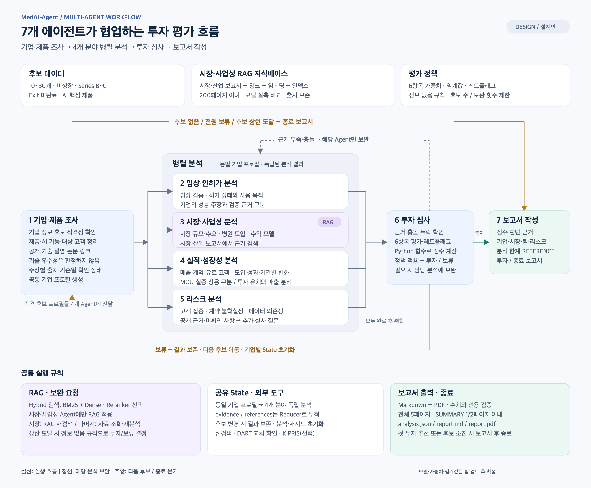
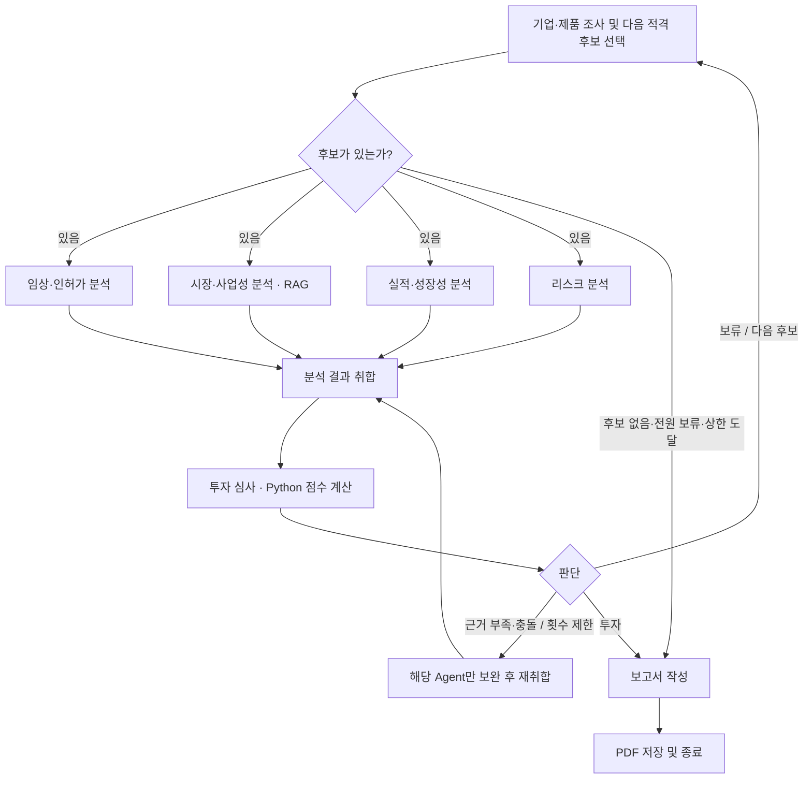

# 의료 AI 스타트업 투자 평가 Multi-Agent 시스템

의료 AI 스타트업의 기술력, 시장성, 경쟁력과 리스크를 분석하고, 투자 가능성 평가 보고서를 생성하는 프로젝트입니다.

LangGraph 기반 Multi-Agent와 Agentic RAG를 활용하여 자료 수집부터 투자 판단, 보고서 생성까지 연결합니다.

> 현재 상태: 설계 단계  
> 투자 판단은 교육용 분석 결과입니다.

## 1. 프로젝트 개요

| 항목 | 내용 |
|---|---|
| 도메인 | Healthcare AI |
| 세부 분야 | 선정 완료 — 분야명 기입 필요 |
| 평가 대상 기업 | TODO |
| 팀 구성 | 5명 |
| 주요 기술 | Python, LangGraph, RAG |
| 최종 결과물 | 투자 평가 보고서, 설계 문서, 소스 코드 |

### 평가 대상 조건

- 국내외 의료 AI 스타트업
- 비상장 기업
- Series B~C 투자 단계
- M&A 등으로 Exit이 완료되지 않은 기업
- AI가 핵심 제품인 기업

후보 기업의 조건 충족 여부는 조사 시점의 자료로 확인합니다.

## 2. 목표

- 역할별 에이전트를 구성하고 LangGraph로 실행 흐름을 연결합니다.
- 시장·사업성 분석 에이전트에만 RAG를 적용합니다.
- 공개 자료를 근거로 기업의 기술력과 사업 가능성을 분석합니다.
- 팀에서 정의한 평가 기준에 따라 투자 또는 보류를 판단합니다.
- 출처와 분석 한계를 포함한 보고서를 생성합니다.

## 3. 전체 실행 흐름

아래는 초기 설계이며 구현 과정에서 변경할 수 있습니다.

아래 이미지는 7개 에이전트 제안안입니다. 기업·제품 조사에서 기초 기술 정보까지 포함한 공통 프로필을 만든 뒤 임상/인허가·시장/사업성·실적/성장성·리스크 분석을 병렬 수행합니다. RAG는 시장·사업성 분석에만 적용하고, 투자 심사에서 필요한 담당 에이전트에 보완을 요청합니다. 투자/보류 분기와 전원 보류 종료를 포함하며, 실행 코드 구현 완료를 의미하지 않습니다.

[확대 가능한 SVG](docs/diagrams/workflow.svg) · [SVG 생성 코드](docs/diagrams/render_workflow.py) · [Graphviz 설계 원본](docs/diagrams/workflow.dot)

1. 도메인에 맞는 스타트업 후보를 탐색합니다.
2. 평가 대상 조건을 확인합니다.
3. 기업 프로필을 바탕으로 임상·인허가, 시장·사업성, 실적·성장성, 리스크를 병렬 분석합니다.
4. 평가 기준에 따라 점수와 투자 여부를 결정합니다.
5. 투자이면 보고서를 생성하고, 보류이면 다음 후보를 분석합니다.
6. 후보가 없거나 전원 보류이면 종료 보고서를 생성합니다.

모든 후보가 보류여도 판단 근거를 포함한 보고서를 생성합니다.
후보 수와 재검색 횟수에 상한을 두어 무한 반복을 방지합니다.

## 4. 에이전트 구성

| 에이전트 | 주요 역할 | 출력 | RAG 적용 |
|---|---|---|---|
| 기업·제품 조사 | 적격성, 제품·AI 기능, 대상 고객, 공개 기술 설명 조사 | 공통 기업 프로필·주장별 출처·기준일·확인 상태 | X |
| 임상·인허가 분석 | 임상 검증, 허가 상태·사용 목적 검토 | 검증 수준·규제 리스크 | X |
| 시장·사업성 분석 | 시장·산업 보고서 검색, 시장 규모·수요·수익 모델 분석 | 시장성·사업화 가능성과 인용 근거 | O |
| 실적·성장성 분석 | 공개 매출·계약·유료 고객·도입 성과 및 시점별 변화 확인 | 출처·기준 기간을 갖춘 실적 지표·미확인 사항 | X |
| 리스크 분석 | 고객 집중, 도입·계약 불확실성, 데이터 의존성 등 공개 자료 기반 사업 운영 리스크 점검 | 근거별 리스크·미확인 사항·추가 실사 질문 | X |
| 투자 심사 | 분석 결과 검토, Python 점수 계산, 보완 요청·판단 | 항목별 평가·투자/보류 | X |
| 보고서 작성 | 분석 결과·점수·출처 종합 | 최종 투자 또는 종료 보고서 | X |

리스크 분석은 기업 프로필과 추가 공개 자료를 바탕으로 사업 운영의 불확실성을 점검합니다. 임상·인허가의 전문 판단은 해당 에이전트가 맡으며, 투자 심사에서 네 분야 결과를 종합합니다. 미확인 사항을 확정된 위험으로 단정하지 않고 추가 실사 질문으로 구분합니다. 경쟁 분석 전담 에이전트는 제외하며, 아래 평가표의 경쟁력 항목과 배점은 재검토가 필요한 기존 초안입니다.

실적·성장성 분석은 MOU·실증·무상 도입·상용 계약을 구분하고, 투자 유치 금액과 매출을 분리합니다. 공개되지 않은 수치는 추정하지 않으며, 같은 기준과 기간으로 비교 가능한 경우에만 성장률을 산출합니다. 계약·도입 성과의 세부 검증은 기업 조사에서 이 에이전트로 분리합니다.

RAG 미적용 에이전트는 웹검색·공식 자료 조회와 입력 근거를 활용합니다. 문서 인덱스 검색은 시장·사업성 분석 에이전트만 수행하며, 다른 에이전트는 공유된 결과와 출처를 활용할 수 있습니다.

## 5. 데이터 수집 계획

환자 데이터나 의료 영상 학습 데이터보다 기업 투자 평가에 필요한 공개 문서를 우선 수집합니다.

| 자료 유형 | 수집 내용 | 주요 출처 |
|---|---|---|
| 기업 정보 | 사업 소개, 창업팀, 제품 | 기업 공식 홈페이지 |
| 투자 정보 | 투자 단계, 투자자, 투자 유치 이력 | 기업·투자사 발표, 스타트업 DB |
| 기술·임상 자료 | 논문, 검증 결과, 성능, 한계 | 논문 원문, 기업 기술 문서 |
| 인허가 자료 | 허가 여부, 적용 제품, 사용 목적 | 식약처, FDA 등 공식 자료 |
| 시장 자료 | 시장 규모, 수요, 성장 전망 | 공공기관·산업 보고서 |
| 경쟁사 자료 | 제품, 기술, 사업화 현황 | 경쟁사 공식 자료 |

### 수집 및 관리 원칙

- RAG에 적용하는 문서는 총 200페이지 이내로 구성합니다.
- 문서마다 기업명, 제목, 발행일, 출처 URL, 페이지 정보를 기록합니다.
- 기업의 홍보 주장과 외부에서 검증된 사실을 구분합니다.
- 확인되지 않은 정보는 추정하거나 생성하지 않고 미확인으로 표시합니다.
- 투자 단계와 인허가 현황은 자료의 기준일을 함께 기록합니다.

## 6. RAG 설계

### 적용 대상

**시장·사업성 분석 에이전트에만 적용합니다.** 시장·산업 보고서에서 시장 규모, 수요, 성장 요인, 병원 도입 및 수익 모델 관련 근거를 검색합니다. 기업 조사·임상·인허가·리스크 분석에는 RAG를 적용하지 않습니다.

### 처리 흐름

문서 수집 → 텍스트 추출 → 문서 분할 → 임베딩 → 벡터 저장소 구축 → 관련 근거 검색 → 출처를 포함한 분석 생성

### Agentic 동작 계획

- 시장·사업성 질문에 필요한 근거를 Hybrid(BM25+Dense) 검색으로 찾습니다.
- 검색 결과가 부족하면 질문을 수정하여 재검색합니다.
- 최대 재검색 횟수를 초과하면 근거 부족으로 기록합니다.

### 임베딩 모델 후보

| 모델 | 비교 목적 |
|---|---|
| BAAI/bge-m3 | 한국어·영어 혼합 자료 검색 |
| intfloat/multilingual-e5-base | 검색 품질과 실행 자원 비교 |
| dragonkue/BGE-m3-ko | 한국어 중심 자료 검색 |

- 최종 선정 모델: TODO
- 선정 이유: TODO
- 벡터 저장소: TODO
- 문서 분할 크기 및 중복 길이: TODO

동일한 문서와 평가 질문으로 검색 정확도, 처리 시간, 메모리 사용량을 비교합니다.
평가 질문별로 정답 근거 문서를 지정하고 상위 검색 결과에 포함되는지 확인합니다.

## 7. 투자 판단 기준

아래 6항목 배점은 초기 제안이며 직접 검토 후 확정합니다. 헬스케어 세부 기준과 레드플래그도 함께 정의합니다.

| 평가 항목 | 확인 내용 | 배점 |
|---|---|---|
| 기술력·임상 근거 | 기술 차별성, 검증 수준, 성능의 한계 | 25 |
| 시장성 | 시장 규모, 수요, 성장 가능성 | 20 |
| 경쟁력 | 경쟁사 대비 차별점과 진입장벽 | 20 |
| 팀 역량 | 창업팀의 기술·의료·사업 경험 | 15 |
| 인허가 | 인허가 적합성, 허가 현황과 규제 리스크 | 10 |
| 사업화 | 병원 도입, 수익 모델 | 10 |
| 합계 | | 100 |

### 판단 정책

- 투자 판단 점수 기준: TODO
- 필수 충족 조건: TODO
- 자료 부족 항목 처리 방식: TODO
- 근거가 부족한 경우 추가 조사 필요 여부를 표시합니다.
- 점수뿐 아니라 주요 리스크와 판단 근거를 함께 제공합니다.
- 확인된 수치 없이 수익률이나 기업가치를 임의로 산출하지 않습니다.

## 8. 공유 State 설계

아래는 초기 State 설계입니다.

| 필드 | 타입 | 설명 |
|---|---|---|
| domain | str | 선정한 의료 AI 세부 분야 |
| candidates | list[dict] | 평가 대상 후보 목록 |
| current_company | dict | 현재 분석 중인 기업 |
| sources | list[dict] | 수집 자료 및 출처 |
| technical_analysis | dict | 기술·임상 분석 결과 |
| market_analysis | dict | 시장성 분석 결과 |
| traction_analysis | dict | 매출·계약·고객·도입 성과와 기준 기간·출처 |
| risk_analysis | dict | 사업 운영 리스크, 근거, 미확인 사항 및 추가 실사 질문 |
| investment_result | dict | 현재 기업의 점수와 판단 |
| company_results | list[dict] | 분석이 완료된 기업별 결과 |
| missing_evidence | list[str] | 부족하거나 확인되지 않은 근거 |
| retry_count | int | 현재 단계의 재검색 횟수 |
| errors | list[str] | 실행 중 발생한 오류 |
| final_report | str | 최종 보고서 |

## 9. 기술 스택

| 구분 | 사용 기술 |
|---|---|
| 개발 언어 | Python |
| 워크플로 | LangGraph |
| LLM | TODO |
| 임베딩 | 오픈소스 모델 비교 후 선정 |
| 벡터 저장소 | TODO |
| 검색 도구 | TODO |
| 문서 처리 | TODO |
| 보고서 출력 | PDF |

## 10. 단계별 TODO 및 일정

아래 체크리스트를 기준으로 진행 상황을 관리합니다. 기존 설계표와 평가표는 초안이며, 각 단계에서 검토 후 확정합니다.

| 마감 | 제출 파일 |
|---|---|
| DAY 3 10:00 — 설계 산출물 | `RAG-Design_{캠퍼스}-{X반}_{이름…}.pdf` |
| DAY 3 15:00 — 개발 산출물 | `RAG-Output_{캠퍼스}-{X반}_{이름…}.pdf` 및 소스 코드 |

### Phase 0. 범위 확정

- [x] 세부 분야 선정 (추천: 영상진단 / CDSS / 생체신호·모니터링 중 하나 — 인허가 기준 적용이 쉬운 분야)
- [ ] 문제 정의 1문단 작성: 누구에게(가상 VC), 무엇을(해당 분야 Series B~C 비상장 AI 기업), 왜 제공하는지 설명
- [ ] 후보 기업 기준 명시: 비상장, Series B~C, Exit 미완료, **AI가 핵심 제품**

### Phase 1. 데이터 수집

- [ ] 시장 동향 PDF 수집: KHIDI 보건산업브리프, 디지털헬스산업협회 실태조사, VC Market Brief 등
- [ ] 페이지 예산 배분: **합계 200페이지 이하** (예: 시장 100 + 기업·투자 50 + 규제·기술 50)
- [ ] HWPX·PDF 파싱 품질 확인: 텍스트 깨짐 여부 확인 후 필요하면 로더 교체
- [ ] 문서별 발행기관, 연도, 제목, URL 메타데이터 기록: REFERENCE 자동 생성에 활용
- [ ] 후보 기업 CSV 작성: **10~30개**, THE VC·아기유니콘·스타트업맵·혁신의료기기 지정 목록 교차 확인
- [ ] CSV 컬럼 구성: `company`, `segment`, `ai_core`, `round_stage`, `listed`, `exit`, `evidence_url`, `last_checked`

### Phase 2. 투자 기준 확정

- [ ] 평가표 초안 제안: Scorecard 6항목 + 헬스케어 세부 기준 + 레드플래그
- [ ] **직접 검토 후 확정**: 가중치, 투자/보류 임계값, **정보 없음 처리 규칙**
- [ ] 평가 결과 Pydantic 스키마 정의: 항목별 점수, 근거, 출처

### Phase 3. 설계 — DAY 2 오전 / 마감 DAY 3 10:00

- [ ] 에이전트 정의표 작성: 역할, RAG 여부(**최소 1개 O**), 사용 Tool
- [ ] 임베딩 후보 3~4개 실측 비교: bge-m3, KURE-v1, multilingual-e5 등
- [ ] 질의 20개로 Hit@k, MRR 측정 및 선정 근거 작성: **리더보드 순위를 근거로 쓰지 않기**
- [ ] State 설계표 작성: `candidates`, `current_idx`, `company_profile`, `tech_summary`, `market_analysis`, `traction_analysis`, `risk_analysis`, `scores`, `decision`, `evidence`(Reducer), `references`(Reducer)
- [ ] Mermaid 그래프 작성: 순차 흐름 + 보류 Loop + 전원 보류 종료 분기
- [ ] 보고서 목차 초안 작성: SUMMARY → 기업 개요·사업 아이디어 → 시장 규모 → 팀 구성 → 사업 리스크(시장·기술·규제·경쟁) → 투자 판단(점수표) → 한계점 → REFERENCE
- [ ] 설계 PDF 작성: `RAG-Design_{캠퍼스}-{X반}_{이름…}.pdf`

### Phase 4. 구현 — DAY 2

- [ ] 프로젝트 구조 구성: `agents/`, `tools/`, `rag/`, `graph.py`, `main.py`, `data/`, `outputs/`
- [ ] RAG 파이프라인 구현: 로딩 → 분할 → 임베딩 → FAISS/Chroma → Hybrid(BM25+Dense) → Reranker(선택)
- [ ] Tool 연결: 웹검색(Tavily 또는 네이버), DART(상장 여부), KIPRIS(특허, 선택)
- [ ] 에이전트 노드 7개 구현: 각 노드의 출처를 State에 누적
- [ ] 투자 점수 계산을 **Python 함수**로 구현: LLM 암산 금지
- [ ] 조건 분기 구현: 투자 → 보고서 / 보류 → 다음 후보 / 후보 없음 → 종료 보고서
- [ ] 무한 루프 방지: 최대 후보 수, 재시도 횟수 제한
- [ ] 보고서 생성 구현: Markdown → PDF, **5페이지 이내**, SUMMARY 1/2페이지 이내

### Phase 5. 검증과 제출 — DAY 3 / 마감 DAY 3 15:00

- [ ] 재현성 테스트: 새 가상환경에서 `main.py` 한 번 실행으로 보고서 생성 확인
- [ ] 보고서 사실 검증: 수치와 기업 정보가 REFERENCE 출처와 일치하는지 확인
- [ ] REFERENCE 표기 형식 점검: 기관 보고서, 논문, 웹페이지
- [ ] README 완성: 목적, 구조, 실행 방법, **Contributors(개인별 역할, PM·PL 제외)**
- [ ] 보고서 PDF 제출: `RAG-Output_{캠퍼스}-{X반}_{이름…}.pdf`
- [ ] 10분 발표 준비: 차별점 + 보고서 핵심 포인트 + Lessons Learned

## 11. 실행 방법

구현 완료 후 실제 동작이 확인된 명령으로 작성합니다.

- Python 버전: TODO
- 의존성 설치 방법: TODO
- 필요한 환경 변수: TODO
- 문서 준비 및 인덱스 생성 방법: TODO
- 실행 명령: TODO
- 결과물 저장 위치: TODO

API 키는 저장소에 포함하지 않으며, 필요한 변수 이름은 `.env.example`로 제공합니다.

## 12. 검증 계획

| 검증 항목 | 확인 내용 |
|---|---|
| 후보 적격성 | 비상장, 투자 단계, Exit 여부 확인 |
| 검색 품질 | 질문에 맞는 근거 문서가 검색되는지 확인 |
| 근거 일치 | 분석 내용이 인용 문서와 일치하는지 확인 |
| 판단 일관성 | 동일한 평가 기준이 모든 기업에 적용되는지 확인 |
| 예외 처리 | 자료 부족, 도구 실패, 전체 보류 상황 처리 |
| 종료 조건 | 후보 소진 및 재검색 상한에서 정상 종료 |
| 재현성 | README에 따라 다른 팀원이 실행 가능한지 확인 |

실제 검증 결과: TODO

## 13. 투자 보고서 구성

보고서는 5페이지 이내로 작성하며 SUMMARY는 1/2페이지 이내로 제한합니다.

1. SUMMARY: 핵심 투자 판단과 근거
2. 기업 개요·사업 아이디어
3. 시장 규모
4. 팀 구성
5. 사업 리스크: 시장·기술·규제·경쟁
6. 투자 판단: 점수표와 판단 근거
7. 한계점
8. REFERENCE: 보고서 작성에 실제 활용한 자료만 기재

## 14. Contributors

아래는 예정 역할이며 제출 전 실제 수행 내용으로 수정합니다.

| 팀원 | 담당 역할 |
|---|---|
| TODO: 이름 1 | 스타트업 탐색, 후보 적격성 확인, 정보 수집 에이전트 |
| TODO: 이름 2 | 기술·임상·인허가 자료 분석 및 해당 에이전트 |
| TODO: 이름 3 | 시장·사업성 RAG, 임베딩 비교, 리스크 분석 에이전트 |
| TODO: 이름 4 | 투자 평가표, 판단 기준, 투자 판단 에이전트 |
| TODO: 이름 5 | LangGraph 통합, State·분기 설계, 보고서 생성 에이전트 |

## 15. 프로젝트 차별점

구현 및 검증한 내용에 맞춰 최종 작성합니다.

- TODO: 기존 방식 대비 차별점
- TODO: 의료 AI 특성을 반영한 평가 방식
- TODO: 근거 추적 및 자료 부족 처리 방식

## 16. 최종 산출물 및 발표

### 산출물

- 설계 문서 PDF
- GitHub 저장소 및 README
- 투자 평가 보고서 PDF

### 발표

README를 기준으로 10분간 발표합니다.

- 문제와 선정 도메인
- 에이전트 및 RAG 설계
- 구현 차별점과 검증 결과
- 투자 보고서 핵심 포인트
- Lessons Learned

## 17. Lessons Learned

- TODO: 설계 및 구현 과정에서 배운 점
- TODO: 발생한 문제와 해결 방법
- TODO: 현재 한계와 향후 개선 방향
