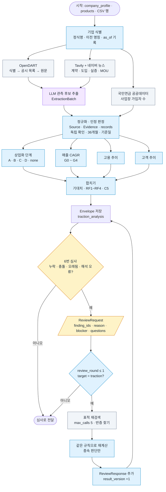

# 실적·성장성 분석 기준서

> **4번 에이전트(실적·성장성 분석)**가 기업을 어떻게 판단하는지 정리한 문서입니다.
> 버전 **v2.0** (schema_version `2.0` / criteria_version `proposed-2.0`) · 최종 수정 2026-09-30 · 작성 변현준
> 기준 문서: 「04_실적·성장성_분석_변현준_v2」(COMMON CONTRACT 2.0) · 코드: `schema.py`

## 한눈에 보기

- **상업화 단계는 A(매출) > B(유료 계약) > C(실증) > D(MOU·수상) > none** 순서로, 최근 36개월의 **인정 근거** 중 가장 높은 단계를 줍니다.
- **인정 근거**는 공시 원문, 또는 거래 상대·독립 자료로 확인된 사실입니다. 회사 자체 주장은 원문만 보존하고 인정하지 않습니다.
- **LLM은 근거 분류·추출만** 합니다. 단계·성장률·추이·레드플래그·C5 점수는 **코드 규칙**으로 계산합니다.
- **none은 "상업화 없음"이 아닙니다.** "인정 근거를 못 찾음" 또는 "조사 미완료"이며, 알 수 없는 값은 `null`/`unknown`으로 둡니다.
- 결과는 공통 **Envelope**(`traction_analysis`)로 내고, 6번이 쓰는 점수 입력 **C5**를 함께 계산합니다. 레드플래그는 **검토 사항이지 탈락 조건이 아닙니다.**
- 6번의 보완 요청(**ReviewRequest**)은 기업당 **1라운드**, 요청당 검색 **5회**까지 처리합니다.

---

## 1. 어떤 기준으로 판단하나

### 1-1. 판단 순서

| 단계 | 하는 일 | 결과 |
|---|---|---|
| ① 기업 식별 | 정식명·이전 명칭·법인 식별자 확정, 기준일(`as_of`) 기록 | company_id, as_of |
| ② 자료 조회 | 공시·뉴스·고용 자료 병렬 조회, 검색 로그 기록 | Source, search_log |
| ③ 근거 분류 | LLM이 원문에서 관측 후보 추출 → 코드가 인정 여부 판정 | Evidence, 관측 records 6종 |
| ④ 규칙 적용 | 단계·성장·추이·기대치·레드플래그·C5 계산 | data, findings, missing_items |

### 1-2. 어떤 근거를 인정하나

**① 근거의 종류**

| 근거 | 예시 | 단계 | 비고 |
|---|---|---|---|
| 매출 | DART 감사보고서 매출액 | A (양수일 때) | |
| 유료 계약·유료 고객 | 공급 계약, 구독 도입 등 대가가 있는 계약 | B | 취소·철회 계약은 제외(이력 보존) |
| 실증 | PoC, 시범 사업 | C | 실적(traction) 아님 |
| MOU·수상 | 업무협약, 수상, 과제 선정 | D | 실적 아님 |
| 투자 유치 | 시리즈 투자 | – | **상업화 판정에서 제외** |
| 허가·판매 개시 | 식약처 허가, 출시 발표 | – | 그 자체로 A/B 근거 아님 |

**② 근거의 확인 상태**

| 구분 | 예시 | 인정 |
|---|---|---|
| 공시 원문 (`official`) | DART 감사보고서, 공공데이터 | ✅ |
| 거래 상대 발표 (`partner`) | 병원·기관의 도입 발표 | ✅ |
| 독립 확인 기사 (`news`, `independent_confirmation=true`) | 거래 상대 취재·복수 출처 기사 | ✅ |
| 보도자료 전재 기사 (`independent_confirmation=false`) | 회사 보도자료를 옮긴 기사 | ❌ 원문 보존만 |
| 회사 자체 발표 (`company`) | 보도자료, 홈페이지, IR | ❌ 원문 보존만 (`evidence_status=unverified`) |

- 출처 종류(`source_type`)와 독립 확인(`independent_confirmation`)은 **따로** 기록합니다. 뉴스라도 보도자료 전재면 독립 확인이 아닙니다.
- 재인용(`original_source_id`가 있는 출처)은 독립 근거로 세지 않습니다.
- 발행일을 모르는 자료는 기준일 당시 존재했는지 확인되지 않으면 점수 근거에서 제외합니다.
- 기준일 이후 공개된 자료는 쓰지 않습니다.

### 1-3. 상업화 단계

| 단계 | 조건 (최근 36개월, 인정 근거) | `traction_recognized` |
|---|---|---|
| **A** | 양수 매출 관측 | true |
| **B** | 유료 계약 | true |
| **C** | 실증 | false |
| **D** | MOU 또는 수상 | false |
| **none** | 인정 근거 없음 | **null** |

- **매출을 못 찾아도 B/C/D는 지워지지 않습니다.** 계약 확인 + 매출 미확인 → B.
- none이면 `none_reason`을 적습니다: `no_recognized_evidence`(조회는 끝났으나 인정 근거 없음) / `search_incomplete`(조회 실패·미완료).
- 공시 조회 결과는 `financial_disclosure_status`(found / not_found / search_failed / not_reviewed)로 따로 적습니다. **DART 미발견만으로 재무 비공개를 확정하지 않습니다.**

### 1-4. 성장성

**① 매출 CAGR과 성장 구간**

- 계산 조건: **같은 범위(연결/별도, 회사 전체/제품)**의 **연속 3개 결산연도**, 시작 매출 > 0, 마지막 매출 ≥ 0
- 공식: `(last / first)^(1/2) − 1`, 소수로 저장 (0.35 = 35%)
- 조건 미충족(누락·음수·범위 차이) → `revenue_cagr = null`, `G0`, `growth_detail.unavailable_reason`에 사유 기록
- **회계 범위 선택 (4번 정의)**: 별도·연결 감사보고서를 모두 읽고, 연도가 많은 쪽을 쓰되 **같으면 연결**을 쓴다. 사업을 자회사로 옮긴 기업은 별도 매출만 보면 역성장으로 오판된다(실측: 케어링 별도 578억→340억 vs 연결 1,286억→1,647억).
- **재작성 연도 처리 (4번 정의)**: 같은 연도 매출이 감사보고서마다 0.5% 넘게 다르면(정정·연결범위 변경) 서로 다른 기준의 값을 섞지 않고, **각 보고서 안의 전년 대비 증가율을 연쇄**해 2년 연평균을 구한다 (`growth_detail.method = chain_linked`, `restated_years` 기록). 예: 케어링 연결 2024년 822억(2024 보고서) vs 1,286억(2025 보고서) → 단순 CAGR 60%(G1)가 아니라 연쇄 27.9%(G2).

| 구간 | 조건 |
|---|---|
| G1 | r ≥ 0.50 |
| G2 | 0.20 ≤ r < 0.50 |
| G3 | 0 ≤ r < 0.20 |
| G4 | r < 0 |
| G0 | 판단 불가 |

**② 고용·고객 추이** (`up / flat / down / unknown`)

- 최신 관측이 `as_of` 이전 **3개월 이내**, 비교값이 **약 12개월 전(±1개월)**, 같은 정의·같은 사업장, 기준값 > 0일 때만 계산
- 변화율 ≥ +5% → up, ≤ −5% → down, 그 사이 → flat, 요건 미충족 → unknown
- 고객은 **도입 기관**과 **유료 고객**을 구분하고(`metric_definition`, `is_paid`), 중복 고객을 제거합니다.
- 근거 없는 up 값은 넣지 않습니다.

### 1-5. 투자 단계별 기대치 (`expectation_status`)

| 투자 단계 (입력 CSV) | 최소 기대 단계 |
|---|---|
| Pre-seed · Seed | C 이상 |
| Series A · Series B | B 이상 |
| Series C 이후 | A |

- 투자 단계 값이 없거나 목록 밖이거나 출처가 오래되면 → `unknown`
- none + `no_recognized_evidence` → `not_met` / none + `search_incomplete` → `unknown` (4번 정의)
- 판정값: `met / not_met / unknown / not_applicable`

### 1-6. 레드플래그

| 코드 | 발동 조건 | status |
|---|---|---|
| **RF1** | 기준일 직전 24개월에 인정 신규 유료 계약을 찾지 못함 | `needs_review` ("계약 없음" 확정 표현 금지) |
| **RF2** | 비교 가능한 매출 감소(G4) 또는 12개월 고용 감소율 ≤ −20% | `confirmed` (수치 사실만, 원인은 실사) |
| **RF3** | 24개월 내 서로 다른 MOU ≥ 2건, 인정 유료 계약·실증 미발견 | `needs_review` |
| **RF4** | 투자 단계 확인됨 + 상업화 단계가 기대치 미만 (`not_met`) | `needs_review` (`unknown`이면 발동 안 함) |

- **24개월** = `as_of`에서 달력 기준 24개월을 뺀 날 ~ `as_of`. 월 단위 날짜가 경계에 걸리면 포함/제외를 확정하지 않고 `date_uncertainty`에 기록합니다.
- 레드플래그마다 `finding_id`를 붙입니다. **RF 코드가 finding id를 대신하지 않습니다.**

### 1-7. C5 점수 입력 (`criteria_inputs.C5`)

| 항목 | 값 |
|---|---|
| 상업화 점수 S | A=5, B=4, C=2, D=1, none=null |
| 성장 점수 T | G1=5, G2=4, G3=3, G4=1, G0=null |
| 계산 | S·T 모두 있으면 `0.7·S + 0.3·T` / T만 없으면 `S`, `growth_status=unknown` / S 없으면 `score=null`, `score_status=unknown` |

- 같은 관측값이면 같은 코드 버전에서 같은 점수가 나와야 합니다(재현성).
- 계약이 취소되거나 근거가 불인정되면 단계·RF·C5를 다시 계산합니다.

### 1-8. 내보내는 결과 (`traction_analysis` = AnalysisEnvelope)

| 구분 | 필드 |
|---|---|
| 공통 실행 정보 | `run_id`, `company_id`, `as_of`, `schema_version`, `criteria_version`, `agent="traction"`, `result_version`, `analysis_status`(complete/partial/failed) |
| 판정 (`data`) | `invest_stage`, `financial_disclosure_status`, `commercial_stage`, `none_reason`, `traction_recognized`, `revenue_by_year`, `revenue_cagr`, `growth_tier`, `growth_detail`, `headcount_trend`/`_detail`, `customer_trend`/`_detail`, `expectation_status`, `red_flags`, `criteria_inputs.C5`, `open_questions` |
| 관측값 (`data`) | `revenue_records`, `contract_records`, `activity_records`, `headcount_records`, `customer_records`, `search_log` |
| 공통 근거 | `sources`, `evidence`, `findings`, `missing_items`, `coverage`, `review_responses` (빈 목록도 생략 안 함) |

- `analysis_status=complete`는 **절차를 끝냈다**는 뜻이지 근거가 충분하다는 뜻이 아닙니다. 근거 상태는 `evidence_status`와 `coverage`로 봅니다.
- ID 형식: `c001:traction:ev01`, `c001:traction:f01`. 보완 라운드에서도 유지합니다.

---

## 2. 정보를 어떻게 모으나

### 2-1. 사용하는 데이터

| 데이터 | 여기서 얻는 것 | source_type | 환경변수 |
|---|---|---|---|
| **OpenDART API** | 기업 식별 → 공시 목록 → 원문(감사보고서 매출) | official | `DART_API_KEY` |
| **Tavily 웹검색** | 계약·도입·실증·MOU 기사 | 기사마다 분류 | `TAVILY_API_KEY` |
| **네이버 뉴스 검색 API** (보류) | 국내 언론 보도 — 검색 API가 NAVER API HUB(네이버 클라우드)로 이관되어 신규 발급 시 사업자 회원이 필요해 **현재 미사용**. 키가 없으면 같은 검색어를 Tavily로 보냄 | news | `NAVER_CLIENT_ID`, `NAVER_CLIENT_SECRET` |
| **국민연금 가입 사업장 내역** (공공데이터포털, 활용가이드 v2.0) | `NpsBplcInfoInqireServiceV2` — 사업장 검색(`getBassInfoSearchV2`, 요청 `wkplNm`/`bzowrRgstNo`) → 월별 기록(`dataCrtYm`, `seq`) → 상세(`getDetailInfoSearchV2`)의 `jnngpCnt`(가입자수). 최신 달과 11~13개월 전 달을 비교, 없으면 기간별 현황(`getPdAcctoSttusInfoSearchV2`)의 월별 취득·상실로 역산 | official | `DATA_GO_KR_API_KEY` |
| **LLM** | 원문 → 관측 후보 추출 (`ExtractionBatch`) | – | 팀 공통 |
| **State 입력** | `company_profile`/`products`(기업·제품), `clinical_analysis`/`risk_analysis`(보완 검색 단서) | – | – |
| **입력 CSV** (`data/startup_list.csv`) | 분석 대상, 투자 단계(`invest_stage`)와 관측 시점 | – | – |

- 개인 식별 정보는 수집하지 않습니다. 비밀키는 환경변수로만 관리하고 로그·보고서에 넣지 않습니다.
- 각 서비스의 제공 항목·호출 한도·집계 범위는 연결 시 확인합니다 (미확인).

### 2-2. 사용하지 않는 데이터

| 데이터 | 사용하지 않는 이유 |
|---|---|
| **혁신의숲** | 이용약관 제16조 제2항이 사전 승낙 없는 **AI 활용(제2호, 비영리 포함)**과 **수집·추출·DB 구축(제3호)**을 금지 → 전면 제외 |
| **THE VC (실행 중 수집)** | 약관이 robots.txt 허용 범위 밖 크롤링·스크래핑과 과도한 필터·검색 이용을 금지. robots.txt는 `/api`와 일부 봇 차단 → **입력 CSV 출처 이력으로만** 보존 |

> 새 데이터 소스는 먼저 **이용약관의 자동 수집·AI 활용 조항**을 확인합니다.

### 2-3. 수집 흐름 (병렬)

| 색 | 의미 |
|---|---|
| 회색 | 외부 데이터 조회 (동시 실행) |
| 보라 | LLM (관측 후보 추출 하나뿐) |
| 파랑 | 코드 규칙 |
| 노랑 | 6번 심사와 주고받는 부분 |

- 조회마다 `search_log`에 검색어·시각·상태(found / not_found / error)를 남깁니다. **정상 조회 미발견과 오류를 구분**해야 none_reason과 coverage를 정확히 적을 수 있습니다.
- 운영 기본값(권장 시작값): 기업 동시 처리 5개, 외부 호출 동시 8개, 타임아웃 30초, 일시 오류 재시도 1회(재시도도 호출 예산에 포함).

### 2-4. 보완 루프 (ReviewRequest → ReviewResponse)

6번 심사가 네 분석 결과를 모아 **누락·충돌·오래된 정보·해석 오류**를 찾으면, 해당 담당에게 묶어서 보완을 요청합니다. **각 분석은 다른 에이전트를 직접 호출하지 않고**, 실행 권한은 오케스트레이터에 있습니다.

**⓪ 실행 모드**

| `review_round` | 모드 | 입력 | 하는 일 |
|---|---|---|---|
| **0** | 최초 실행 | CSV 행 + `company_profile`/`products` | 2-3절 흐름대로 수집·판정 |
| **1** | 보완 | `review_requests` 중 `target_agent="traction"` + 기존 Envelope + `clinical_analysis`/`risk_analysis` | 요청받은 finding만 표적 재검색 → 재계산 |
| **> 1** | 종료 | – | 검색하지 않고 기존 결과 반환 (`max_review_rounds=1`) |

- 4번 대상 요청이 없으면 검색하지 않고 기존 Envelope를 그대로 둡니다.
- 보완 요청을 담는 State 키 이름은 `review_requests`(list)로 정합니다 (4번 정의, PDF 미지정).

**① 6번이 보내는 것: ReviewRequest**

| 항목 | 내용 |
|---|---|
| `request_id`, `company_id`, `product_ids` | 요청 식별, 대상 기업·제품 |
| `target_agent` | `traction` |
| `finding_ids`, `criterion_id` | 막힌 판단 id, 관련 기준(C5) |
| `reason` | missing_evidence / conflict / stale_information / interpretation_error |
| `blocker` | 무엇 때문에 심사가 막혔는지 |
| `questions[]` | `{question_id, text}` — "정말 맞아? 다시 찾아봐"에 해당 |
| `related_evidence_ids`, `previous_result_version`, `as_of`, `review_round` | 관련 근거, 이전 버전, 기준일, 라운드 |
| `search_budget.max_calls` | 기본 5 |
| `completion_conditions[]` | 종료 조건 |
| `context` | `search_period`, `preferred_sources`, `previous_search_history`, `related_results` |

**② 4번의 보완 검색 방법: finding 종류별로 최초 실행과 다르게**

| 막힌 판단 (category) | 최초 실행 | 보완 때 다르게 하는 것 |
|---|---|---|
| `stage`, RF1 (유료 계약 미발견) | 기업명 + 계약·도입 검색 | 동의어 확장(공급, 납품, 구독, 수가 청구) · `clinical_analysis`/`risk_analysis`의 **제품명·기관명**으로 검색 · 회사 발표로만 있던 근거가 거래 상대·독립 기사로 확인되는지 재검색 |
| RF3 (MOU만 반복) | MOU 건수 집계 | MOU 상대 기관별로 **이후 유료 전환·실증** 기사 추적 |
| `disclosure`, `growth` (공시·매출) | 현재 사명으로 DART 조회 | **이전 사명·영문 사명**으로 재조회, 정정 공시 확인, 연결/별도 범위 맞추기 |
| `headcount`, RF2 (고용 급감) | 사업장 1곳 조회 | 사명 변경·이전·분할로 **사업장이 나뉘었는지** 확인 후 같은 범위로 비교 |
| `customer` | 기사 속 도입 기관 수 | 기관별 날짜 정렬, **중복 제거·유료/도입 구분** 재집계 |
| `expectation`, RF4 (단계 미달) | CSV 투자 단계 기준 | **투자 단계 자체**와 관측 시점을 다른 출처로 재확인 후 재비교 |

공통 규칙:
- `previous_search_history`에 있는 검색어·URL은 다시 쓰지 않습니다.
- 이미 찾은 원문의 재발견, 지지 근거, 반박 근거, 실제 변경 내역을 구분합니다.
- 새 근거도 1장의 인정 규칙을 똑같이 통과해야 합니다. 보완이라고 기준을 느슨하게 하지 않습니다.
- **검색 결과 없음은 기존 판단이 옳다는 증명이 아닙니다.** 핵심 질문이 남으면 `unresolved`로 끝내고, 판단불가 여부는 6번이 정합니다.

**③ 4번이 돌려주는 것: 최신 Envelope + ReviewResponse**

| 항목 | 내용 |
|---|---|
| `resolution` | resolved / partially_resolved / unresolved / search_failed |
| `change_type` | facts_updated / interpretation_updated / both / unchanged |
| `updated_finding_ids`, `new_source_ids` | 바뀐 판단, 새 출처 |
| `question_results[]` | `{question_id, status(answered/partially_answered/unanswered), answer, evidence_ids}` |
| `remaining_unknowns`, `limitations` | 남은 미확인, 한계 |

- 보완 후 **전체 Envelope**를 반환하고 `result_version`을 +1 합니다. 요청 밖 결과는 유지하고 **종속 판단만** 다시 계산합니다.
- 일부 실패해도 확보한 수정 사항은 보존합니다.

---

## 3. 왜 이 기준을 골랐나

### 3-1. 매출과 유료 계약만 실적(traction)으로 인정

- **이유**: 의료 AI는 "도입했다"는 발표가 많지만 실제로 돈을 받는지는 별개입니다. 실증·MOU까지 실적으로 치면 성과가 부풀려집니다. 그래서 C·D는 단계로만 기록하고 `traction_recognized=false`로 둡니다.
- **근거**
  - 팀 설계도 요구사항: "MOU·실증·상용 구분", "투자 유치와 매출 분리"
  - VC는 무료 사용량과 실제 유료 계약 확장을 구분해서 봅니다 (CRV)
  - "인허가는 결승선이 아니라 출발선" (카카오벤처스, 2025) → 허가·판매 개시를 A/B 근거로 보지 않음

### 3-2. 독립적으로 확인된 근거만 인정

- **이유**: 비상장 스타트업은 공시 의무가 없어 회사 자료가 대부분이고 과장 위험이 큽니다. v2는 출처 종류와 **독립 확인 여부를 분리**해, 뉴스 기사라도 보도자료 전재면 인정하지 않습니다.
- 회사 주장을 버리지 않고 **원문을 보존**(`unverified`)해 두면, 보완 때 거래 상대 발표로 확인되는지 추적할 단서가 됩니다.
- **근거**: 과제 요구사항(사실과 추론의 구분, REFERENCE 표기), 통합 개정판 공통 계약

### 3-3. 단계는 36개월, 레드플래그는 24개월, 기준일 고정

- **이유**: 36개월이면 3개 결산연도를 볼 수 있어 CAGR 계산과 맞고, 24개월은 "최근 활동" 신호에 맞는 짧은 창입니다. 기준일(`as_of`)을 고정하고 이후 자료를 빼야 같은 입력에서 같은 결과가 나옵니다.
- 경계 날짜를 억지로 포함/제외하지 않고 `date_uncertainty`로 남겨, 판정 문장과 수치가 어긋나는 것을 막습니다.

### 3-4. none을 "상업화 없음"으로 보지 않음

- **이유**: 비상장 기업은 매출이 공개되지 않는 경우가 대부분이라, 못 찾은 것과 없는 것을 구분해야 합니다. v1.5의 "정보 없음 = 최하 등급"을 버리고, none이면 C5 상업화 점수를 `null`로 두어 6번이 판단불가 여부를 결정하게 했습니다.
- **근거 (비상장 매출이 공개되는 조건)**: 「주식회사 등의 외부감사에 관한 법률 시행령」 제5조 제1항 — 직전 사업연도 말 자산 또는 매출 500억 원 이상, 또는 자산 120억·부채 70억·매출 100억·종업원 100명 중 2개 이상이면 외부감사 대상(설립 첫해 등 제외, 같은 조 제3항)
- **의미**
  - 공시 매출은 최소 1년 늦게 나타납니다.
  - Seed~Series A는 대부분 외감 대상이 아니므로 `financial_disclosure_status=not_found`가 흔합니다. 이것만으로 비공개를 확정하지 않습니다.
  - Series B~C는 투자금으로 자산 120억을 넘기 쉬워 매출이 작아도 대상이 될 수 있습니다 (추론).

### 3-5. 계약이 확인되면 매출이 안 보여도 B

- **이유**: 외감 대상이 아니면 매출이 공개되지 않고, 계약 시점과 매출 인식 시점이 다르며, 최근 계약은 아직 감사보고서에 반영되지 않았을 수 있습니다. 그래서 "매출 미발견은 B/C/D를 지우지 않는다"고 정했습니다.

### 3-6. 단계와 실적 인정, 실행 상태와 확인 상태를 나눈 이유

- 단계(A~D)는 근거의 강도, `traction_recognized`는 실적 인정 여부입니다. 초기 기업에 실증까지만 기대하는 것(3-7)과 "실증은 실적이 아니다"(3-1)를 동시에 지키기 위해 나눴습니다.
- `analysis_status`(절차 완료)와 `evidence_status`·`coverage`(사실 확인)를 나눠야 "다 돌았지만 근거는 부족함"을 표현할 수 있습니다.

### 3-7. 투자 단계별 기대치

- **이유**: 초기 기업에 후기 기업 잣대를 대면 단계와 무관하게 모두 불리해집니다.
- **v2 변경**: Series A 기대치를 C → **B**로 올리고, Series C는 성장 조건(G2) 없이 **A**만 요구합니다. 성장은 C5의 T 점수로 따로 반영되므로 기대치와 중복시키지 않았습니다.
- **근거**
  - 의료기기 스타트업 단계별 이정표: Series B는 인허가·판매 시작, Series C는 매출 확대 (MedDeviceGuide, 2026, 미국 기준 — 국내 적용은 추정)
  - 지금은 허가 후 1년 안에 매출을 내야 살아남는다는 VC 시각 (카카오벤처스, 2025) → Series A부터 유료 계약 기대 (추론)
- 통합 개정판의 **권장 기본안**이며 팀 합의 시 `schema.py`의 `STAGE_EXPECTATION`만 바꿉니다.

### 3-8. 성장 구간 기준값 (50% / 20% / 0%)과 CAGR

- **이유**: 1년 증감은 일시적 변동에 흔들리므로 **연속 3개년 CAGR**로 계산합니다. 범위(연결/별도, 회사/제품)가 다른 값을 섞으면 성장률이 왜곡되므로 같은 시계열에 넣지 않습니다.
- **근거**
  - VC는 초기 성장 기업에 연 2~3배 성장을 기대합니다 (Value Add VC, 2026; AI Business, 2026, 소프트웨어 기준)
  - 의료는 병원 도입·보험 절차로 매출이 느리게 잡혀 (카카오벤처스, 2025) +50%를 고성장, +20%를 정상 성장 하한으로 낮춰 잡았습니다 (팀 결정)

### 3-9. 고용·고객 추이를 ±5%, 12개월 창으로 보는 이유

- 매출이 비공개인 기업이 많아 다른 성장 신호가 필요합니다. 고용은 국민연금 공공데이터라 독립 자료이고, 도입 기관 수는 의료 AI의 핵심 성과인 병원 채택과 이어집니다.
- 관측 시점이 제각각이면 비교가 무의미하므로 "최신 3개월 이내 vs 약 12개월 전"으로 고정했습니다. ±5% 미만 변화는 소규모 기업의 잡음으로 보고 flat 처리합니다 (권장 기본안).

### 3-10. 레드플래그 기준값과 status

- **RF1 (24개월)**: 허가 후 1년 내 매출 시각(카카오벤처스, 2025)에 여유를 둔 기간. "못 찾음"은 "없음"이 아니므로 `needs_review`로만 기록합니다.
- **RF2 (고용 −20%)**: 작은 회사는 1~2명 이동으로 비율이 크게 흔들려, −10%는 너무 민감하고 −30%는 너무 둔하다고 판단 (팀 결정). 수치 자체는 확인된 사실이라 `confirmed`, 원인은 실사 대상입니다.
- **RF3 (서로 다른 MOU ≥ 2)**: 유료 전환 없이 협약만 반복되면 사업성 미검증 신호. 같은 MOU 중복 보도를 두 건으로 세지 않도록 "서로 다른"을 명시했습니다.
- **RF4**: 자료가 부족한 기업을 기대 미달로 몰지 않도록 `unknown`이면 발동하지 않습니다.

### 3-11. C5 = 0.7·S + 0.3·T

- **이유**: 비상장 기업은 성장 자료(3개년 매출)가 거의 없어 T가 비는 경우가 많습니다. 확인 가능성이 높은 상업화 단계에 더 큰 비중을 두고, T가 없으면 S만 쓰되 `growth_status=unknown`을 명시해 6번이 인지하게 했습니다.
- 가중치와 점수표는 통합 개정판의 **권장 기본안**이며 `schema.py` 설정값(`C5_*`)으로 관리합니다.

### 3-12. 보완은 1라운드, 요청당 5회

- **이유**: 실행 시간과 API 비용을 통제하고 무한 반복을 막기 위해서입니다. 대신 막힌 finding만 **최초 실행과 다른 방법**(2-4절 ②)으로 찾아 한 번의 보완이 실제로 결과를 바꿀 수 있게 했습니다.

---

## 4. 역할 나눔과 6번 전달 사항

### 4-1. 다른 에이전트와의 경계

| 4번이 하는 것 | 다른 에이전트가 하는 것 |
|---|---|
| 매출, 유료 계약·고객, 실증·MOU, 고용 | 기업 정보·투자 이력 → `company_profile` |
| 단계·성장·추이·RF·C5 계산 | 허가·임상 상태 → clinical |
| 기간별 변화 (매출, 고용, 고객) | 시장 규모 → market (RAG) |
| 근거와 점수 입력(C5) 산출 | 최종 점수·선정·보고서 → 6번 `investment_review` |

### 4-2. 6번 투자 심사 담당자에게 알릴 것

- 필드 이름은 1-8절과 `schema.py`(schema_version 2.0) 기준입니다. 바뀌면 이 문서 버전을 올려 알립니다.
- 점수는 `data.criteria_inputs.C5`를 쓰세요. `score_status=unknown`이면 판단불가 여부를 6번이 정합니다.
- 레드플래그는 **감점 검토 사항이지 탈락 조건이 아닙니다.** `needs_review`는 "확인 필요", `confirmed`는 "수치 확인됨"입니다.
- none은 보고서에 "상업화 없음"이 아니라 **"인정 근거 미확인"**(`no_recognized_evidence`) 또는 **"조사 미완료"**(`search_incomplete`)로 표기합니다.
- 보완이 필요하면 `review_requests`에 `target_agent="traction"`인 ReviewRequest를 넣어 주세요(2-4절). 결과는 `review_responses[]`와 갱신된 `result_version`으로 확인합니다.

---

## 5. 한계와 확인할 것

- 점수·가중치·기대치·검색 예산은 통합 개정판의 **권장 기본안**으로, 팀 합의 전 값입니다.
- 입력 CSV 50개사 중 26개가 Seed~Series A라 none·G0가 많이 나올 가능성이 큽니다. CAGR은 연속 3개년이 필요해 대부분 G0일 것으로 예상됩니다 (추론).
- 국민연금 API(활용가이드 v2.0 확인): **제공 시점 기준 1년치, 3인 이상 법인 사업장만** 제공. 가이드에 "통계자료로 활용할 수 없음" 문구가 있어 개별 기업 관측값으로만 쓴다. 사업장명 검색이 정확 일치 방식으로 보여 법인명 표기(주식회사·(주))를 바꿔 여러 번 검색한다 (추론). 케어링·레모넥스는 표기 6종 모두 0건이었음(구 파라미터명 사용 시점) → 재확인 필요.
- **DART 실측 (2026-09-30, 비상장 5개사)**: 정형 재무 API(`fnlttSinglAcntAll`)는 5곳 모두 `013`(미지원) → 비상장 매출은 `list.json`(pblntf_ty=F)으로 감사보고서를 찾고 `document.xml` 원본을 파싱해야 합니다. 감사보고서 확인 3곳(레모넥스·딥바이오·메디픽셀), 미확인 2곳(모니터코퍼레이션·케어링). 호출 응답은 0.15~0.8초.
- **매출 파싱 실측 (`agent.py`의 `extract_revenue`)**: 4개사 감사보고서 8건 모두 규칙 파싱 성공(건당 ~3ms), 인접 연도 교차검증(신 보고서 전기 = 구 보고서 당기) 4쌍 일치. 과목명은 '매출액'·'영업수익' 혼재, 주석번호 열('4,23')·'-'(=0)·표별 단위 표기를 처리해야 합니다. 파싱 실패 시 LLM 추출로 폴백합니다.
- CAGR은 중간 연도 급락을 가립니다 (예: 3개년 CAGR은 G1이지만 마지막 해 −40%). 연도별 값은 `revenue_by_year`에 그대로 남겨 6번이 볼 수 있게 합니다.
- 감사보고서는 당기·전기를 함께 싣기 때문에 **보고서 2개로 3개년 매출**을 만들 수 있습니다. 별도·연결 보고서가 함께 있는 기업(레모넥스)은 `accounting_scope`를 한쪽으로 통일해야 합니다.
- 최신 감사보고서가 기준일보다 1년 이상 오래된 기업(딥바이오 2023.12, 레모넥스 2024.12)이 있어, 외감 대상 제외·제출 지연 여부를 구분할 수 없습니다 → `financial_disclosure_status`와 `missing_items`에 기록합니다.
- 입력 CSV 42개사(중복 제외) 중 DART 고유번호가 이름으로 정확히 일치하는 곳은 14개사뿐이며, 짧은 이름(닷·아크)은 동명 법인 위험이 있어 식별자 확인이 필요합니다.
- 보도자료 전재 기사를 `independent_confirmation=false`로 제대로 걸러내는지는 추출 프롬프트로 시험해 봐야 합니다.
- 보완 때 `clinical_analysis`/`risk_analysis`에서 제품명·기관명을 뽑으려면 각 담당의 필드 위치를 확인해야 합니다.
- `review_requests` 키 이름, `contract_status`의 `signed` 외 값, `accounting_scope` 값, `Coverage` 필드 구성, none일 때 expectation 처리는 PDF에 없어 **4번이 정한 값**입니다.
- 해외 기준(MedDeviceGuide, VC 성장률)을 국내에 적용한 부분은 추정입니다.

---

## 6. 참고 자료

- 「04_실적·성장성_분석_변현준_v2」(COMMON CONTRACT 2.0, 2026-09-30) — 이 문서의 기준 명세
- 과제 가이드: AI 스타트업 투자 평가 (SKALA, Notion)
- 팀 설계도: MedAI-Agent 에이전트 워크플로 (README)
- 국가법령정보센터. 주식회사 등의 외부감사에 관한 법률 시행령 제5조. https://www.law.go.kr/
- 카카오벤처스(2025-07-17). 디지털 헬스케어 스타트업의 진짜 드라마는 인허가 이후 시작된다. https://www.kakao.vc/blog/kv-healthcare-brownbag-meeting-2025
- 카카오벤처스(2026-01-08). 디지털 헬스케어 스타트업 투자, VC는 어떤 지표를 볼까?. https://www.kakao.vc/blog/digital-healthcare-startup-metrics
- MedDeviceGuide(2026). Medical Device Startup Funding Guide: What VCs Want in 2026. https://meddeviceguide.com/blog/medical-device-startup-funding-guide-vc-2026
- CRV. B2B SaaS AI Startup Investment Criteria. https://www.crv.com/content/b2b-saas-ai-startup-investment-criteria
- Value Add VC(2026). Series A AI Startup Requirements 2026. https://valueaddvc.com/blog/what-series-a-investors-are-looking-for-in-ai-startups-in-2026
- AI Business(2026). 15 AI Startup Metrics Investors Track in 2026. https://aibusiness.vc/startups/ai-startup-metrics-investors-track
- 금융감독원. OpenDART. https://opendart.fss.or.kr/
- 공공데이터포털. 국민연금공단_국민연금 가입 사업장 내역. https://www.data.go.kr/ (세부 항목 미확인)
- (주)마크앤컴퍼니. 혁신의숲 이용약관 제15조, 제16조 — 사용 제외 근거
- 더브이씨. 이용약관 및 robots.txt (2026-09-29 확인). https://thevc.kr/robots.txt

---

## 7. 변경 이력

| 날짜 | 버전 | 변경 내용 |
|---|---|---|
| 2026-09-30 | v2.0 | 연결 우선·재작성 연도 연쇄 증가율 규칙 추가(케어링 실측), 국민연금 API를 활용가이드 v2.0에 맞춤(V2 엔드포인트·카멜케이스·월별 기록) |
| 2026-09-30 | v2.0 | 네이버 검색 API 보류(API HUB 이관·사업자 회원 필요) → 뉴스 검색은 Tavily 단독 |
| 2026-09-30 | v2.0 | DART 실측 반영: 비상장 정형 재무 API 미지원 확인 → 감사보고서 원본 파싱으로 확정 (5장)|
| 2026-09-30 | **v2.0** | 통합 개정판(COMMON CONTRACT 2.0) 반영. 출력을 공통 **AnalysisEnvelope**로 변경, Source → Evidence → Finding 근거 체계와 관측 records 6종 도입 |
| 2026-09-30 | v2.0 | 인정 기준을 `source_level` 3단계 → `source_type` + `independent_confirmation`으로 분리. 회사 주장은 원문 보존(unverified) |
| 2026-09-30 | v2.0 | 단계 창 36개월, RF1·RF3 창 24개월(달력 기준, `date_uncertainty`). 매출 미발견이 B/C/D를 지우지 않음. 허가·판매 개시는 A/B 근거 아님 |
| 2026-09-30 | v2.0 | none = 최하 등급 → **none ≠ 상업화 부재**. `none_reason`(no_recognized_evidence/search_incomplete), `traction_recognized` null 허용, `financial_disclosed`(bool) → `financial_disclosure_status` |
| 2026-09-30 | v2.0 | 성장: 전년 대비 → 연속 3개년 CAGR. 추이: 최신 3개월 이내 vs 12개월 전, ±5% 임계값 |
| 2026-09-30 | v2.0 | 기대치: Series A C→B, Series C "A+G2" → "A". `meets_stage_expectation`(bool) → `expectation_status`(met/not_met/unknown/not_applicable) |
| 2026-09-30 | v2.0 | 레드플래그에 `finding_id`·`status`(confirmed/needs_review) 추가. RF4는 unknown이면 미발동 |
| 2026-09-30 | v2.0 | **C5 점수 입력** 추가 (S: A5 B4 C2 D1, T: G1 5 G2 4 G3 3 G4 1, 0.7S+0.3T). "등급+근거만" 원칙 → 4번이 C5 입력까지 계산 |
| 2026-09-30 | v2.0 | 루프: `retry_count`·`verify_request`·VerifyRequest/VerifyResult → `review_round`·`review_requests`·**ReviewRequest/ReviewResponse**. 기업당 1라운드, 요청당 검색 5회. 보완 검색 방법(반증 찾기)은 유지 |
| 2026-09-30 | v1.5 | 연동 규칙 확정(State 키 `verify_request`, retry_count 증가는 6번, 레드플래그 감점 요소), retry_count 모드 명시 |
| 2026-09-30 | v1.4 | 루프를 "막힌 판단 검증" 방식으로 변경 (findings, VerifyRequest, VerifyResult) |
| 2026-09-29 | v1.3 | 재조사 방식 변경 (RetryLog, queries_used, urls_seen) |
| 2026-09-29 | v1.2 | 흐름도 재작성, schema.py 초안 작성 |
| 2026-09-29 | v1.1 | 문서 구성을 "판단 기준 / 수집 방법 / 선정 이유"로 재정리 |
| 2026-09-29 | v1 | 판단 기준 최초 확정, 외감 기준 시행령 확인, 혁신의숲 제외, THE VC 입력 출처로만 사용 |
